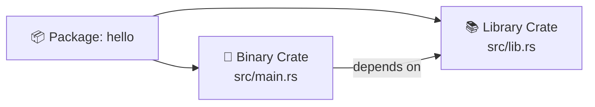
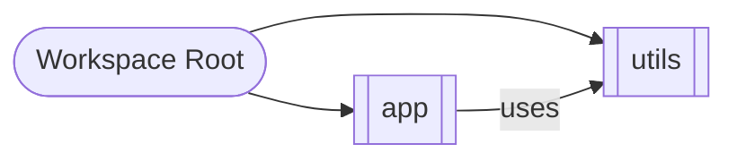

# 🦀 Rust Cargo & Module System — Quick Guide

> 이 문서는 한 장짜리 스냅샷 이미지에 담긴 **Rust Cargo / 모듈 / 크레이트** 내용을 읽고, 핵심만 **표 + Mermaid 다이어그램**으로 정리한 요약본입니다.  
> 실습 가능한 **샘플 코드**와 **프로젝트 트리**도 함께 제공합니다.

---

## 1) Cargo 한눈에 보기

| 목적 | 명령 | 비고 |
|---|---|---|
| 새 바이너리 크레이트 생성 | `cargo new hello` | `src/main.rs` 생성 |
| 새 라이브러리 크레이트 생성 | `cargo new --lib mylib` | `src/lib.rs` 생성 |
| 빌드(디버그) | `cargo build` | `target/debug` |
| 실행(자동 빌드) | `cargo run` | `main.rs` 필요 |
| 빠른 타입체크 | `cargo check` | 컴파일 빠름(링크 X) |
| 릴리즈 빌드 | `cargo build --release` | `target/release` |
| 테스트 실행 | `cargo test` | `#[test]` 함수 실행 |
| 문서 생성/보기 | `cargo doc --open` | public API 문서 |
| 포맷팅 | `cargo fmt` | rustfmt 필요 |
| 린팅 | `cargo clippy` | clippy 필요 |
| 의존성 업데이트 | `cargo update` | `Cargo.lock` 갱신 |
| 워크스페이스 루트에서 멤버 빌드 | `cargo build -p member_name` | 특정 멤버만 |

> 자주 쓰는 조합: `cargo run -q`(조용히), `RUST_LOG=debug cargo run`(로그), `cargo test -q -- --nocapture`(출력 보기).

---

## 2) 크레이트(패키지) & 프로젝트 레이아웃

- **바이너리 크레이트**: 실행 가능한 프로그램. `src/main.rs`가 **크레이트 루트**.
- **라이브러리 크레이트**: 라이브러리. `src/lib.rs`가 **크레이트 루트**.
- 하나의 패키지에 **둘 다** 존재 가능: `src/lib.rs`(lib) + `src/main.rs`(bin)
- 추가 바이너리: `src/bin/*.rs` (파일 당 하나의 `main()`)

```text
hello/
├─ Cargo.toml
└─ src
   ├─ main.rs        # 바이너리 크레이트 루트
   └─ lib.rs         # (선택) 라이브러리 크레이트 루트
```

**Mermaid(프로젝트 레이어):**



---

## 3) 모듈 시스템(2018 에디션 기준)

- `mod xxx;` : **파일/폴더를 모듈로 포함** (컴파일 타임에 연결)
- `pub` : 다른 모듈에서 접근 가능하도록 공개
- 경로 접두사: `crate::`(현재 크레이트), `super::`(부모), `self::`(자신)
- **2018 에디션** 이후: 대부분의 경우 `extern crate` **불필요**

### 예) `communicator` 모듈 구조

```text
src/
├─ main.rs
└─ communicator/
   ├─ mod.rs
   ├─ client.rs
   └─ server.rs
```

- `communicator/mod.rs`

```rust
pub mod client;
pub mod server;
```

- `communicator/client.rs`

```rust
pub fn connect() {
    println!("client::connect");
}
```

- `communicator/server.rs`

```rust
pub fn connect() {
    println!("server::connect");
}
```

- `src/main.rs`

```rust
mod communicator;                 // 폴더를 모듈로 포함
use crate::communicator::client;  // 공개된 하위 모듈 사용

fn main() {
    client::connect();
}
```

**Mermaid(모듈 트리):**

```mermaid
flowchart TD
    A[crate root (main.rs)] --> B[mod communicator]
    B --> C[mod client]
    B --> D[mod server]
    A ==> C
```

> **자주 나는 오류**  
> - `unresolved import`: `mod …;` 또는 `pub mod …;` 선언 누락  
> - `private function` 접근: `pub fn` 필요  
> - 파일명/폴더명과 `mod` 선언의 불일치

---

## 4) 의존성 관리 – `Cargo.toml`

`Cargo.toml`의 대표 섹션:

```toml
[package]
name = "hello"
version = "0.1.0"
edition = "2021"

[dependencies]
rand = "0.8"           # 예: 외부 크레이트 추가
regex = { version = "1", features = ["unicode"] }

[dev-dependencies]
pretty_assertions = "1.4"

[features]
default = []
fast = []

[profile.release]
lto = true
codegen-units = 1
```

### 버전 규칙(semver)
| 표기 | 의미(대략) |
|---|---|
| `1.2.3` | 정확히 그 버전(또는 `^1.2.3`과 동일로 보는 경우 多) |
| `^1.2`  | **호환** 업데이트 허용: `>=1.2.0, <2.0.0` |
| `~1.2`  | 패치 업데이트 허용: `>=1.2.0, <1.3.0` |
| `1.*`   | 마이너/패치 와일드카드 |
| `>=1.2, <2.0` | 범위 지정 |

### 외부 크레이트 사용 예

- `Cargo.toml`

```toml
[dependencies]
rand = "0.8"
```

- `src/main.rs`

```rust
use rand::Rng;

fn main() {
    let mut rng = rand::thread_rng();
    let x: i32 = rng.gen_range(0..10);
    println!("random = {x}");
}
```

> **오류 패턴**: `use rand::Rng;` 컴파일 오류 → `Cargo.toml`에 `rand` 누락.

---

## 5) 라이브러리 + 바이너리 동시 구성

```text
myapp/
├─ Cargo.toml
└─ src
   ├─ lib.rs     # 라이브러리: 공개 API
   └─ main.rs    # 실행 파일: 라이브러리 사용
```

- `src/lib.rs`

```rust
pub mod math;

pub fn greet(name: &str) -> String {
    format!("Hello, {name}!")
}
```

- `src/math.rs`

```rust
pub fn add(a: i32, b: i32) -> i32 { a + b }
```

- `src/main.rs`

```rust
use myapp::{greet, math};

fn main() {
    println!("{}", greet("Rust"));
    println!("1 + 2 = {}", math::add(1, 2));
}
```

---

## 6) 여러 바이너리와 예제

```
src/bin/
├─ server.rs   # fn main() { … }
└─ client.rs   # fn main() { … }

examples/
└─ hello.rs    # cargo run --example hello
```

- 특정 바이너리만 실행: `cargo run --bin server`

---

## 7) 테스트 배치

- **단위 테스트**(크레이트 내부): `src/*.rs` 안에

```rust
#[cfg(test)]
mod tests {
    use super::*;

    #[test]
    fn it_works() {
        assert_eq!(2 + 2, 4);
    }
}
```

- **통합 테스트**(외부 관점): `tests/` 폴더

```text
tests/
└─ api_tests.rs
```

```rust
#[test]
fn greet_api() {
    assert_eq!(myapp::greet("A"), "Hello, A!");
}
```

실행: `cargo test`

---

## 8) 워크스페이스(Workspace)

여러 패키지를 **한 번에** 관리하는 루트:

```text
myws/
├─ Cargo.toml        # 워크스페이스 루트
├─ app/              # 멤버 1
└─ utils/            # 멤버 2
```

- 루트 `Cargo.toml`

```toml
[workspace]
members = ["app", "utils"]
resolver = "2"  # 최신 권장
```

- 빌드: `cargo build` (전체) / `cargo build -p utils` (특정 멤버)

**Mermaid(워크스페이스 의존성):**



---

## 9) 흔한 오류와 즉시 해결 팁

| 증상 | 원인 | 해결 |
|---|---|---|
| `cannot find crate for '…'` | `Cargo.toml` 누락 | `Cargo.toml`에 의존성 추가 후 `cargo build` |
| `unresolved import` | `mod`/`pub mod` 미선언, 경로 오타 | 파일 구조와 `mod` 선언 정합성 확인 |
| `function is private` | `pub` 생략 | 외부에서 쓸 항목 `pub`로 공개 |
| `multiple bins found` | 여러 `src/bin/*.rs` 존재 | `--bin <name>`로 대상 지정 |
| `duplicate lang item` | 중복된 크레이트 타입 | lib/main 중복 설정 점검 |
| 러스트 에디션 경로 혼란 | 2018+ 경로 규칙 미적용 | `crate::`, `super::`, `self::` 사용 습관화 |

---

## 10) 한 장 예제 — `communicator`

```text
communicator_demo/
├─ Cargo.toml
└─ src
   ├─ main.rs
   └─ communicator
      ├─ mod.rs
      ├─ client.rs
      └─ server.rs
```

**Cargo.toml**

```toml
[package]
name = "communicator_demo"
version = "0.1.0"
edition = "2021"

[dependencies]
```

**src/communicator/mod.rs**

```rust
pub mod client;
pub mod server;
```

**src/communicator/client.rs**

```rust
pub fn connect() {
    println!("client::connect");
}
```

**src/communicator/server.rs**

```rust
pub fn connect() {
    println!("server::connect");
}
```

**src/main.rs**

```rust
mod communicator;
use crate::communicator::client;

fn main() {
    client::connect();
}
```

실행:

```bash
cargo run
# client::connect
```

---

### 참고 체크리스트
- [ ] 파일/폴더 이름 ↔ `mod` 선언 일치
- [ ] 외부 크레이트는 `Cargo.toml`에 추가
- [ ] 공개 API는 `pub`으로 노출
- [ ] 워크스페이스일 때 루트/멤버 `Cargo.toml` 구분
- [ ] `cargo check`로 빠르게 피드백

---


