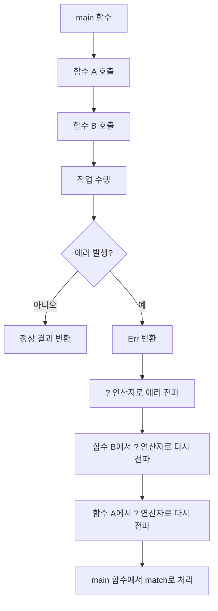

# 에러 처리 전파
에러 처리 전파는 하위 함수에서 발생한 에러를 상위 함수로 넘기는 것을 의미합니다.  
Rust에서는 Result<T, E> 타입을 통해 이 작업을 명시적으로 수행하며, ? 연산자를 사용하면 이를 간결하게 표현할 수 있습니다.

## 🧭 전통적인 방식: match로 처리
```rust
fn read_username() -> Result<String, Error> {
    let file_result = File::open("hello.txt");
    let mut file = match file_result {
        Ok(file) => file,
        Err(e) => return Err(e),
    };

    let mut username = String::new();
    match file.read_to_string(&mut username) {
        Ok(_) => Ok(username),
        Err(e) => Err(e),
    }
}
```

- match를 사용해 Result를 직접 분기 처리
- 명확하지만 장황하고 반복적임

## ✨ 간결한 방식: ? 연산자
```rust
fn read_username2() -> Result<String, Error> {
    let mut file = File::open("hello.txt")?;
    let mut username = String::new();
    file.read_to_string(&mut username)?;
    Ok(username)
}
```

- ?는 Result가 Err일 경우 즉시 현재 함수에서 Err를 반환
- Ok일 경우 내부 값을 꺼내서 다음 단계로 넘김
- match를 자동으로 처리해주는 문법적 설탕(syntactic sugar)

### ✅ 더 간결하게
```rust
fn read_username3() -> Result<String, Error> {
    let mut username = String::new();
    File::open("hello.txt")?.read_to_string(&mut username)?;
    Ok(username)
}
```


### ✅ 가장 간단한 형태
```rust
fn read_username4() -> Result<String, Error> {
    fs::read_to_string("hello.txt")
}
```

- 표준 라이브러리에서 이미 Result를 반환하므로 그대로 전파 가능

## 🛠️ ? 연산자의 동작 원리
- Result<T, E> 타입에서 ?를 붙이면:
- Ok(t) → 내부 값 t를 꺼내서 계속 진행
- Err(e) → 현재 함수에서 return Err(e) 수행
- 내부적으로는 From::from(e)를 호출해 에러 타입을 변환할 수도 있음

## 🚀 유용성 요약
| 처리 방식     | 유용성 요약                                                   |
|---------------|--------------------------------------------------------------|
| `match`       | 모든 경우를 명시적으로 처리 가능. 안전하지만 코드가 장황해질 수 있음 |
| `Result<T, E>`| 에러를 값으로 표현하여 호출자에게 전달 가능. 복구 가능한 에러 처리에 적합 |
| `?` 연산자    | 에러 전파를 간결하게 표현. 가독성과 유지보수성이 뛰어남           |


### 예를 들어 아래처럼 여러 작업을 연결할 수 있습니다:
```rust
fn process_file(path: &str) -> Result<String, Error> {
    let content = fs::read_to_string(path)?; // 읽기
    let transformed = content.to_uppercase(); // 변환
    Ok(transformed)
}
```

## 에러 전파 표시


### 🧠 설명 요약
- ? 연산자는 에러가 발생하면 즉시 호출자에게 Err를 반환합니다.
- 호출자도 ?를 사용하면 에러가 계속 위로 전파됩니다.
- 최종적으로 main 함수에서 match나 unwrap, expect 등을 통해 에러를 처리하게 됩니다.


## 🔐 보너스: Option에서도 사용 가능
```rust
fn get_third(vec: Vec<i32>) -> Option<i32> {
    let third = vec.get(2)?; // None이면 바로 None 반환
    Some(*third)
}
```

- ?는 Option에서도 동작하며, None일 경우 즉시 반환


---

