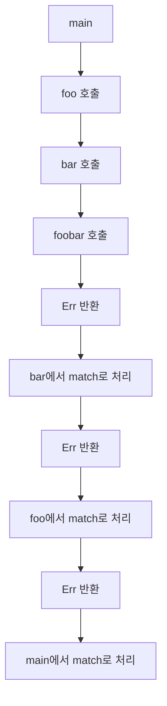
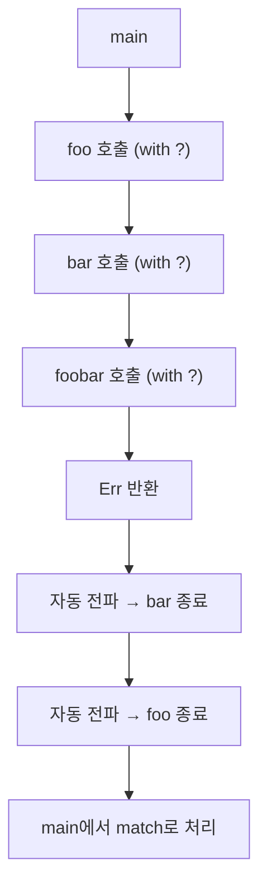

# ? 연산자
Rust의 ? 연산자가 얼마나 강력하고 간결한지를 잘 보여주는 코드입니다.
이제 이 흐름을 Mermaid 차트로 시각화해보면, ? 연산자가 어떻게 에러를 자동으로 전파하는지 한눈에 이해할 수 있음.

- ?연산자는 값이 None이거나 Err 타입이면 바로 현재 함수의 반환 값으로 반환해 버립니다.
- 아니면 Ok나 Some안에 저장된 원래 값을 꺼내서 값을 받아서 계속 처리를 진행하게 해 줍니다. 


## 예제 코드

### ? 사용하지 않은 경우
```rust

fn foobar() -> Result<i32, String> {
    let r = "foobar_error".to_string();
    Err(r)
}

fn bar() -> Result<i32, String> {
    let r  = foobar();
    match r {
        Ok(n) => {
            println!("Do something {} from foobar", n);
            return Ok(n);
        },
        Err(s) => {
            println!("Do error {} from foobar", s);
            return Err(s);
        }
    }
}

fn foo() ->Result<i32, String>{
    let r  = bar();
    match r {
        Ok(n) => {
            println!("Do something {} from bar", n);
            return Ok(n);
        },
        Err(s) => {
            println!("Do error {} from bar", s);
            return Err(s);
        }
    }
}

fn main() {
    let r = foo();
    match r {
        Ok(n) => println!("Do something {} from foo", n),
        Err(s) => println!("Do error {} from foo", s)
    }
}
// 결과물
// Do error foobar_error from foobar
// Do error foobar_error from bar
// Do error foobar_error from foo
```


### ? 사용한 경우
```rust
fn foobar() -> Result<i32, String> {
    let r = "foobar_error".to_string();
    Err(r)
}

fn bar() -> Result<i32, String> {
    let r  = foobar()?;
    println!("Do something {} from foobar", r);
    return Ok(r);
}

fn foo() ->Result<i32, String>{
    let r  = bar()?;
    println!("Do something {} from bar", r);
    return Ok(r);
}

fn main() {
    let r = foo();
    match r {
        Ok(n) => println!("Do something {} from foo", n),
        Err(s) => println!("Do error {} from foo", s)
    }
}
```


## 🧭 match 방식의 에러 전파 흐름


## 🧶 이 방식은 각 함수에서 match를 통해 에러를 직접 처리하고 다시 반환합니다.
장점은 명시적 처리, 단점은 코드가 장황해질 수 있다는 점이죠.

### ⚡ ? 연산자 방식의 에러 전파 흐름


🌊 이 방식은 에러가 발생하면 ? 연산자가 즉시 호출자에게 반환합니다.
장점은 간결하고 가독성 높음, 단점은 세밀한 에러 처리에는 부적합할 수 있어요.

## 실제적인 예제

### ❌ ? 연산자 없이 에러 처리한 예
```rust
use std::fs::File;
use std::io::{self, Write};

fn write_info(name: &str) -> io::Result<()> {
    match File::create("my_best_friends.txt") {
        Err(e) => {
            // 파일 생성시 에러가 발생하면 종료
            return Err(e);
        }
        Ok(mut f) => {
            if let Err(e) = f.write_all(format!("name: {}\n", name).as_bytes()) {
                // 파일 쓰기시 에러가 발생하면 종료
                return Err(e);
            }
        }
    };
    Ok(())
    // 파일 생성 및 쓰기가 성공하면 Ok(()) 리턴
}

fn main() {
    if let Ok(_) = write_info("John") {
        println!("Writing to file succeeded!");
    }
}
```

### ✅ ? 연산자를 사용한 간결한 예
```rust
use std::fs::File;
use std::io::{self, Write};

fn write_info(name: &str) -> io::Result<()> {
    let mut file = File::create("my_best_friends.txt")?;
    file.write_all(format!("name: {}\n", name).as_bytes())?;
    Ok(())
}

fn main() {
    if let Ok(_) = write_info("John") {
        println!("Writing to file succeeded!");
    }
}
```

- 두 코드 모두 같은 기능을 수행하지만, ? 연산자를 사용한 두 번째 예는 훨씬 간결하고 가독성이 좋습니
- 실무에서는 로깅이나 분기 처리가 필요한 경우 match를, 단순 전파가 필요한 경우 ?를 사용하는 것이 일반적이에요.

## ✨ 핵심 요약
| 방식     | 장점                              | 단점                              | 사용 예시                      |
|----------|-----------------------------------|-----------------------------------|-------------------------------|
| `match`  | 명시적 처리 가능<br>로깅 및 분기 용이 | 코드가 장황해질 수 있음             | `match result { Ok(v) => ..., Err(e) => ... }` |
| `?`      | 간결하고 가독성 높음<br>자동 에러 전파 | 세밀한 에러 분기 처리 어려움         | `let v = some_func()?;`       |

---

