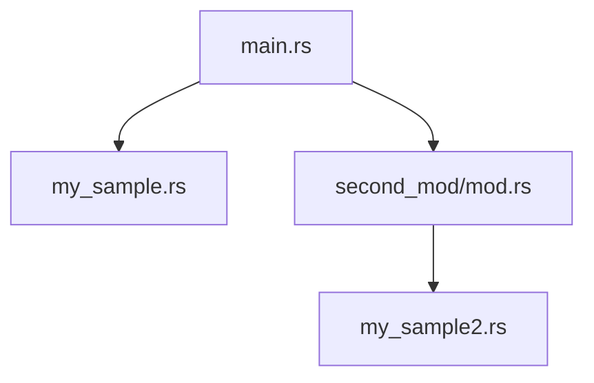

# 🧠 기본 개념 정리

## 📦 패키지(Package)와 크레이트(Crate)
- 패키지: 하나 이상의 크레이트를 포함할 수 있는 Cargo 단위
- 크레이트: 컴파일 가능한 단위 (라이브러리 또는 실행 파일)

## 📁 모듈(Module)
- 하나의 프로젝트 내에서 여러 파일을 참조하고 연결하는 방식
- mod 키워드로 선언하며, 파일 이름이 모듈 이름이 됨
- pub 키워드로 외부에서 접근 가능하게 설정

### 🧩 단일 파일 내 모듈 선언
```rust
mod my_module {
    pub fn test_my_mod() {
        println!("This is my_module::test_my_mod()");
    }
}

fn main() {
    my_module::test_my_mod();
}
```

### 또는 use를 활용해 더 간결하게:
```rust
use my_module::test_my_mod;

fn main() {
    test_my_mod();
}
```


## 📂 외부 파일 모듈로 분리
### 📄 my_sample.rs
```rust
pub fn sample() {
    println!("This is my_sample::sample()");
}
```

## 📄 main.rs
```rust
mod my_sample;

fn main() {
    my_sample::sample();
}
```

### 또는 use로 더 간결하게:
```rust
mod my_sample;
use my_sample::sample;

fn main() {
    sample();
}
```


## 🗂 디렉토리 기반 모듈 구조
Rust에서는 디렉토리를 모듈처럼 사용할 수 있어요. 이때는 해당 디렉토리 안에 mod.rs 파일을 만들어야 합니다.

### 📁 구조 예시
```
src/
├── main.rs
├── my_sample.rs
└── second_mod/
    ├── mod.rs
    └── my_sample2.rs
```

### 📄 second_mod/mod.rs
```rust
pub mod my_sample2;
```
- mod.rs에  모듈 이름을 명시해 준다

### 📄 second_mod/my_sample2.rs
```rust
pub fn sample2() {
    println!("Here sample2");
}
```
- My_sample2 파일에 함수를 선언해 준다.


## 📄 main.rs
```rust
mod second_mod;

fn main() {
    second_mod::my_sample2::sample2();
}
```

### 또는 use로 더 간결하게:
```rust
mod second_mod;
use second_mod::my_sample2::sample2;

fn main() {
    sample2();
}

```

## 🗺️ Mermaid로 구조 시각화


- main.rs는 my_sample.rs와 second_mod 디렉토리를 참조
- second_mod/mod.rs는 my_sample2.rs를 모듈로 선언


### ✅ 핵심 요약: Rust 모듈 시스템

| 키워드   | 설명                                                  |
|----------|-------------------------------------------------------|
| `mod`    | 새로운 모듈을 선언하거나 외부 파일을 모듈로 연결함     |
| `use`    | 모듈 내 항목을 현재 스코프로 가져와 간편하게 사용함   |
| `pub`    | 항목을 외부 모듈에서도 접근 가능하도록 공개함         |
| `mod.rs` | 디렉토리 기반 모듈의 루트 역할을 하는 파일             |

---

