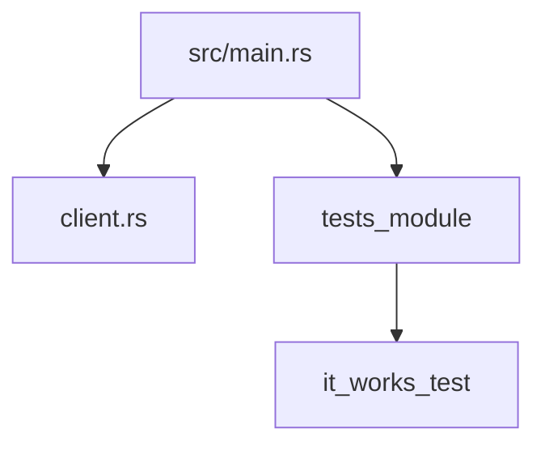
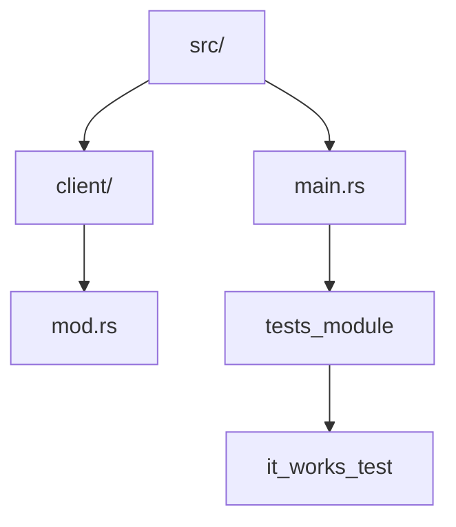

# use

## 사용법
```rust
pub mod a {
    pub mod series {
        pub mod of {
            pub fn nested_modules() {}
        }
    }
}

fn main() {
    a::series::of::nested_modules();
}
```
- 완전하게 경로를 지정한 이름을 참조하는 것은 너무 길어질 수 있습니다. 

### 간단한 사용법
```rust
use a::series::of;
fn main() {
    of::nested_modules();
}

```
- 러스트의 use 키워드는 여러분이 스코프 내에서 호출하고 싶어하는 함수의 모듈을 가져옴으로써 긴 함수 호출을 줄여줍니다.  
a::series::of 모듈을 바이너리 크레이트의 루트 스코프로 가져온 예제
- use a::series::of; 줄은 of 모듈을 참조하고 싶은 곳마다 a::series::of 전부를 사용하기 보다는 of를 사용할 수 있다는 뜻.

## 사용법 예제 2
```rust
use a::series::of::nested_modules;
fn main() {
    nested_modules();
}

enum TrafficLight {
    Red,
    Yellow,
    Green,
}

use TrafficLight::{Red, Yellow};

fn main() {
    let red = Red;
    let yellow = Yellow;
    let green = TrafficLight::Green;
}
```
- Green variant에 대해서는 여전히 TrafficLight 이름공간을 명시하고 있는데, 이는 use 구문 내에 Green를 포함하지 않았기 때문입니다.


### 사용법 3
```rust
enum TrafficLight {
    Red,
    Yellow,
    Green,
}

use TrafficLight::*;

fn main() {
    let red = Red;
    let yellow = Yellow;
    let green = Green;
}

```
- *는 글롭(glob) 이라고 부르며, 이는 이름공간 내에 공개된 모든 아이템을 가져올 것입니다.  
- 글롭은 편리하지만, 여러분이 예상한 것보다 더 많은 아이템을 끌어와서 이름 간의 충돌(naming conflict)의 원인이 될수도 있습니다.


## 📌 주요 개념 정리
- 경로 축약: use를 통해 긴 경로를 줄여 코드 가독성을 높일 수 있습니다.
- 모듈 단위 vs 함수 단위: 모듈 전체를 가져올 수도 있고, 특정 함수만 가져올 수도 있습니다.
- 열거형 variant 가져오기: {Red, Yellow}처럼 일부만 가져오거나 *로 전체를 가져올 수 있습니다.
- 글롭 import (*) 주의: 편리하지만 이름 충돌 가능성이 있으므로 신중하게 사용해야 합니다.
- 상위 모듈 접근 (super): 테스트나 내부 모듈에서 상위 모듈의 항목을 가져올 때 사용합니다.

---

## Rust의 모듈 경로, super, 그리고 디렉토리 구조에 대한 개념이 필요합니다.

## ❌ 왜 에러가 나는가?
```rust
#[cfg(test)]
mod tests {
    #[test]
    fn it_works() {
        client::connect(); // ❌ 에러 발생
    }
}
```

이 코드에서 client::connect()는 현재 모듈(tests) 기준으로 client 모듈을 찾으려 하지만,  
tests 내부에는 client가 정의되어 있지 않기 때문에 "unresolved import" 또는 "unresolved module" 에러가 발생합니다.

## 해결 방법
```rust
#[cfg(test)]
mod tests {
    use super::client; // ✅ 상위 모듈에서 client를 가져옴
    #[test]
    fn it_works() {
        client::connect(); // ✅ 정상 작동
    }
}
```


## 🗂️ 디렉토리 구조 (Mermaid로 시각화)
아래는 src/ 디렉토리 기준의 구조를 Mermaid로 표현한 것입니다:


## 혹은 client가 mod.rs로 구성된 디렉토리라면:


- 이 구조에서 main.rs는 client 모듈을 mod client;로 선언하고, client.rs 또는 client/mod.rs에 connect() 함수가 정의되어 있어야 합니다.

---

## 🔍 super 키워드란?
Rust에서 super는 현재 모듈의 상위 모듈을 참조하는 키워드입니다. 즉, 모듈 계층 구조에서 한 단계 위로 올라가서 항목을 가져올 수 있게 해줍니다.
### 예시 구조
```rust
// src/main.rs
mod client;

#[cfg(test)]
mod tests {
    use super::client; // super는 main.rs를 기준으로 함
    #[test]
    fn it_works() {
        client::connect(); // 정상 호출
    }
}
```

- tests는 main.rs 내부의 하위 모듈
- super는 main.rs를 가리킴
- client는 main.rs에서 선언된 모듈이므로 super::client로 접근 가능

### ✅ Rust 모듈 경로 키워드 핵심 요약
| 키워드   | 설명                                                                 |
|----------|----------------------------------------------------------------------|
| `self`   | 현재 모듈을 기준으로 경로를 지정할 때 사용. 모듈 내부 참조에 유용함. |
| `super`  | 현재 모듈의 상위 모듈을 참조. 테스트 모듈이나 중첩 모듈에서 자주 사용됨. |
| `crate`  | 크레이트 루트(보통 `main.rs` 또는 `lib.rs`) 기준으로 경로를 지정함. 전체 프로젝트 범위 참조에 사용됨. |

---


## ✅ use 키워드 사용법 요약
| 구문 형태                          | 설명                                                                 |
|-----------------------------------|----------------------------------------------------------------------|
| `use a::series::of;`              | `of` 모듈을 현재 스코프로 가져와 `of::nested_modules()`처럼 사용 가능 |
| `use a::series::of::nested_modules;` | 함수만 직접 가져와 `nested_modules()`처럼 간단히 호출 가능             |
| `use TrafficLight::{Red, Yellow};` | 열거형의 일부 variant만 가져와 `Red`, `Yellow` 직접 사용 가능         |
| `use TrafficLight::*;`            | 모든 variant를 가져오지만, 이름 충돌 위험 있음 (글롭 import)           |
| `use super::client;`              | 현재 모듈의 상위 모듈에서 `client`를 가져옴 (테스트 모듈 등에서 유용)  |

---
