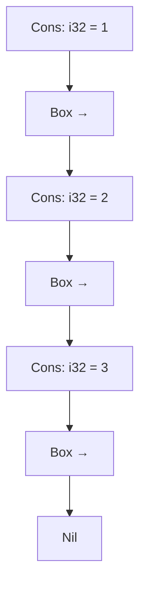

# Box
Rust의 Box 스마트 포인터, 재귀 타입, 그리고 Trait Object에 대한 핵심 개념들 정리.


## 📦 Box<T>란?
Box는 Rust에서 가장 기본적인 스마트 포인터입니다.
데이터를 힙에 저장하고, 스택에는 그 데이터를 가리키는 포인터만 남깁니다.

### ✅ Box의 특징
| 상황 또는 목적                                      | 설명                                                                 |
|-----------------------------------------------------|----------------------------------------------------------------------|
| 컴파일 타임에 크기를 알 수 없는 타입 처리           | Box는 포인터이므로 크기가 고정되어 있어 컴파일러가 타입을 처리할 수 있음 |
| 큰 데이터를 복사 없이 소유권 이동                   | Box는 포인터만 이동하므로 데이터 복사 비용 없이 소유권을 넘길 수 있음     |
| 재귀 타입 정의                                      | Box를 사용하면 무한 크기 문제 없이 재귀적으로 타입을 정의할 수 있음      |
| Trait을 구현한 다양한 타입을 하나로 다루고 싶을 때 | `Box<dyn Trait>`를 사용하면 런타임에 다양한 타입을 하나의 인터페이스로 처리 가능 |


### 🧪 기본 사용 예시
```rust
fn main() {
    let b = Box::new(5);
    println!("b = {}", b); // b = 5
}
```


### 🔁 재귀 타입과 Box의 필요성
Rust는 크기를 알 수 없는 재귀 타입을 직접 정의할 수 없습니다.
예를 들어 아래와 같은 List는 컴파일 에러가 발생합니다:
```rust
enum List {
    Cons(i32, List), // ❌ 무한 크기
    Nil,
}
```

❗ 에러 메시지
error[E0072]: recursive type `List` has infinite size


### ✅ 해결 방법: Box로 간접 참조
```rust
#[derive(Debug)]
enum List {
    Cons(i32, Box<List>),
    Nil,
}
```
#### 코드
```rust
enum List {
    Cons(i32, List),
    Nil,
}
use List::{Cons, Nil};

fn main() {
    let list = Cons(1, Cons(2, Cons(3, Nil)));
}
```

```rust
struct Node {
    val: i32,
    next: Option<Node>
}

fn main() {

    let mut head = Node {
        val: 1,
        next: None
    };

    head.next = Some(Node {
        val:2,
        next: None
    });

    println!("{}", head.val);

/*
error[E0072]: recursive type `Node` has infinite size
 --> src/main.rs:2:1
  |
2 | struct Node {
  | ^^^^^^^^^^^
3 |     val: i32,
4 |     next: Option<Node>
  |                  ---- recursive without indirection
  |
help: insert some indirection (e.g., a `Box`, `Rc`, or `&`) to break the cycle
  |
4 |     next: Option<Box<Node>>
  |                  ++++    +
    
 */
}


struct Node {
    val: i32,
    next: Option<Box<Node>>
}

fn main() {

    let mut head = Node {
        val: 1,
        next: None
    };

    head.next = Some(Box::new(Node{val: 2, next: None}));
    println!("{}", head.val);

}


```

이제 Box<List>는 고정된 크기의 포인터이므로 컴파일러가 처리할 수 있습니다.

### 🧠 Cons 리스트 구조 (Mermaid 시각화)


- 각 Cons는 값을 하나 갖고, 다음 노드를 Box로 가리킵니다
- Box는 힙에 저장된 다음 노드를 참조합니다

### 🐾 Trait Object와 Box<dyn Trait>
Trait Object는 런타임에 다양한 타입을 하나의 인터페이스로 다루는 방식입니다.
impl Trait은 리턴 타입이 하나의 구체 타입일 때만 사용 가능하지만,
서로 다른 타입을 리턴하려면 Box<dyn Trait>이 필요합니다.
#### ❌ 오류 예시
```rust
fn random_animal() -> impl Animal {
    if rand::random::<f64>() < 0.5 {
        Dog{}
    } else {
        Cat{} // ❌ 서로 다른 타입
    }
}
```

### ✅ 해결 방법
```rust
fn random_animal() -> Box<dyn Animal> {
    if rand::random::<f64>() < 0.5 {
        Box::new(Dog{})
    } else {
        Box::new(Cat{})
    }
}
```


- Box<dyn Trait>은 동적 디스패치를 통해 다양한 타입을 처리
- 컴파일러는 vtable을 생성하여 런타임에 메서드를 호출


### 소스
```rust
struct Dog{}
struct Cat{}

trait Animal {
    fn noise(&self) -> &'static str;
}

impl Animal for Dog {
    fn noise(&self) -> &'static str {
        "baaaa"
    }
}
impl Animal for Cat {
    fn noise(&self) -> &'static str {
        "meow"
    }
}

fn random_animal() -> impl Animal {
    if rand::random::<f64>() < 0.5 {
        Dog{}
    } else{
        Cat{}
    }
}

fn main() {

    println!("{}", random_animal().noise());
/*
error[E0308]: `if` and `else` have incompatible types
  --> src/main.rs:23:9
   |
20 | /     if rand::random::<f64>() < 0.5 {
21 | |         Dog{}
   | |         ----- expected because of this
22 | |     } else{
23 | |         Cat{}
   | |         ^^^^^ expected `Dog`, found `Cat`
24 | |     }
   | |_____- `if` and `else` have incompatible types
   |
help: you could change the return type to be a boxed trait object
   |
19 | fn random_animal() -> Box<dyn Animal> {
   |                       ~~~~~~~       +
help: if you change the return type to expect trait objects, box the returned expressions
   |
21 ~         Box::new(Dog{})
22 |     } else{
23 ~         Box::new(Cat{})
   |
    
 */
}

struct Dog{}
struct Cat{}

trait Animal {
    fn noise(&self) -> &'static str;
}

impl Animal for Dog {
    fn noise(&self) -> &'static str {
        "baaaa"
    }
}
impl Animal for Cat {
    fn noise(&self) -> &'static str {
        "meow"
    }
}

fn random_animal() -> Box<dyn Animal> {
    if rand::random::<f64>() < 0.5 {
        Box::new(Dog{})
    } else{
        Box::new(Cat{})
    }
}

fn main() {

    println!("{}", random_animal().noise());
    //meow

}

```

## 📦 Box 요약표
| 개념                  | 설명                                                             |
|-----------------------|------------------------------------------------------------------|
| `Box<T>`              | 데이터를 힙에 저장하고 스택에는 포인터만 남김                    |
| 재귀 타입 해결        | `Box`를 사용해 무한 크기 문제 해결 (`Box<List>`)                 |
| Trait Object 처리     | `Box<dyn Trait>`로 다양한 타입을 하나의 인터페이스로 처리        |
| 성능 오버헤드 없음    | 단순한 간접 참조만 제공하므로 다른 스마트 포인터보다 가볍고 빠름 |

---


# 🧠 핵심 질문
왜 impl Trait은 함수 인자에서는 가능하지만, 반환 타입에서는 제한이 있을까?

## ✅ impl Trait vs Box<dyn Trait> 비교
| 항목                     | `impl Trait`                                | `Box<dyn Trait>`                              |
|--------------------------|---------------------------------------------|------------------------------------------------|
| 사용 위치                | 함수 인자, 반환값 (단일 타입일 때만)        | 함수 반환값 (서로 다른 타입 처리 가능)         |
| 타입 결정 시점           | 컴파일 타임                                 | 런타임                                          |
| 성능                     | 빠름 (정적 디스패치)                        | 느림 (동적 디스패치, vtable 사용)              |
| 유연성                   | 제한적 (하나의 구체 타입만 반환 가능)       | 높음 (여러 타입을 trait로 추상화 가능)         |
| 크기 추론 가능 여부      | 가능 (컴파일러가 타입 크기 알 수 있음)      | 가능 (Box는 포인터이므로 크기 고정)            |
| 대표 사용 예            | 제네릭 함수 인자                            | 다양한 타입을 반환하는 trait 기반 함수         |


## 🔍 함수 인자에서 impl Trait 사용
```rust
fn my_func(var: impl Trait) {
    my_func(var);
    my_func(var);
}
```
- impl Trait은 제네릭처럼 동작하며, 호출 시점에 타입이 결정됨
- 컴파일러는 각 타입마다 별도의 코드 생성 (monomorphization)

### ❌ 함수 반환에서 impl Trait 사용 시 에러
```rust
fn random_animal() -> impl Animal {
    if rand::random::<f64>() < 0.5 {
        Dog{}
    } else {
        Cat{} // ❌ 서로 다른 타입
    }
}
```

- Dog와 Cat은 서로 다른 타입이므로 impl Trait로는 반환 불가
- 컴파일러는 하나의 고정된 타입만 반환할 수 있어야 함

### ✅ 해결: Box<dyn Trait>로 trait object 반환
```rust
fn random_animal() -> Box<dyn Animal> {
    if rand::random::<f64>() < 0.5 {
        Box::new(Dog{})
    } else {
        Box::new(Cat{})
    }
}
```

- Box<dyn Trait>는 동적 디스패치를 통해 런타임에 타입 결정
- Box는 힙에 저장되므로 크기가 고정되어 컴파일러가 처리 가능

## 🧭 요약 정리
| 개념               | 설명                                                                 |
|--------------------|----------------------------------------------------------------------|
| `impl Trait` 인자  | 컴파일 타임에 타입 결정, monomorphization 가능                       |
| `impl Trait` 반환  | 하나의 고정 타입만 반환 가능, 서로 다른 타입이면 에러 발생            |
| `Box<dyn Trait>`   | 힙에 저장된 trait object 반환, 런타임에 타입 결정, 동적 디스패치 사용 |

---


