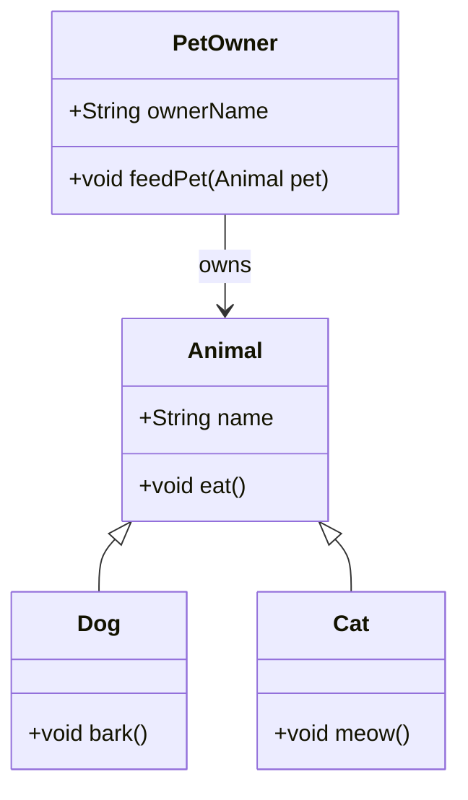
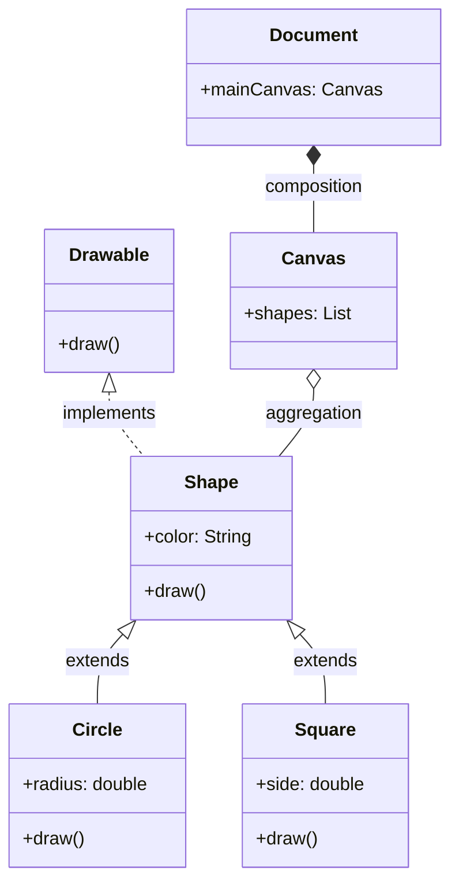
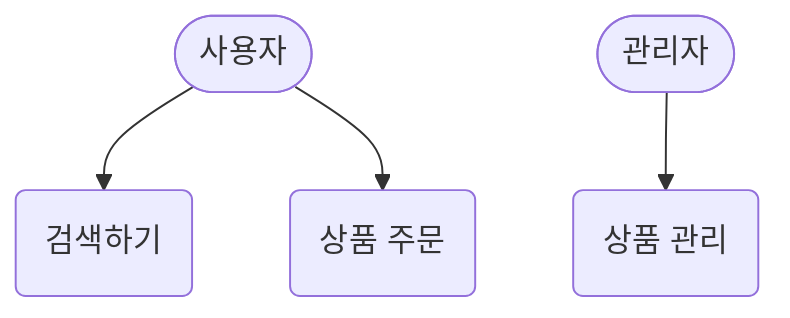
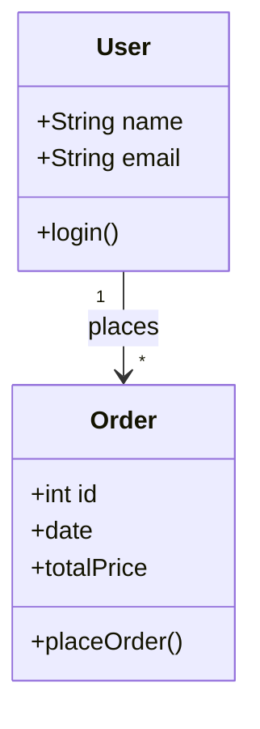
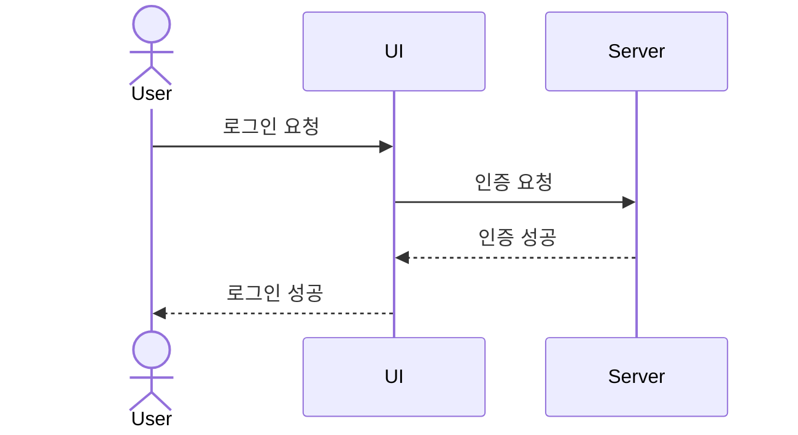
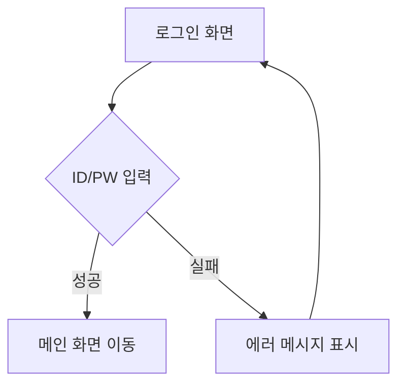

# 📘 UML 클래스 다이어그램 기본 구성
## 🔹 클래스(Class)
- 표기: 직사각형 박스
- 구성:
- 상단: 클래스 이름
- 중단: 속성(필드)
- 하단: 메서드(함수)
- 접근 제어자:
- `+` : public
- `-` : private
- `#` : protected
- `~` : package(default)

## 🧭 클래스 간 관계 및 화살표 지시
| 관계 유형         | 설명                                                   | 화살표 표기법             | 예시 방향 (A → B)         |
|------------------|--------------------------------------------------------|----------------------------|----------------------------|
| Generalization (상속) | 자식 클래스가 부모 클래스의 속성과 메서드를 상속함         | 실선 + 빈 삼각형           | `자식 클래스 → 부모 클래스` |
| Realization (구현)    | 클래스가 인터페이스의 메서드를 구현함                   | 점선 + 빈 삼각형           | `구현 클래스 → 인터페이스` |
| Association (연관)    | 한 클래스가 다른 클래스를 참조함                         | 실선                        | `A → B` (참조 방향 표시 가능) |
| Aggregation (집합)    | 전체-부분 관계. 부분은 독립적으로 존재 가능               | 실선 + 빈 마름모            | `전체 클래스 → 부분 클래스` |
| Composition (합성)    | 강한 전체-부분 관계. 부분은 전체에 종속됨                 | 실선 + 채워진 마름모        | `전체 클래스 → 부분 클래스` |
| Dependency (의존)     | 한 클래스가 다른 클래스의 기능을 일시적으로 사용함         | 점선 + 화살표               | `A → B` (의존 방향 표시)     |

## 🧩 인터페이스 및 특수 클래스 표기
| 요소 유형         | 설명                                                   | 표기 방식                          | 예시 표기                         |
|------------------|--------------------------------------------------------|-----------------------------------|----------------------------------|
| 인터페이스        | 메서드의 명세만 존재하며, 클래스가 이를 구현함             | `<<interface>>` 또는 이탤릭체      | `<<interface>> Drawable`         |
| 추상 클래스       | 일부 메서드만 구현되어 있고, 하위 클래스가 구현을 완성해야 함 | `<<abstract>>`, `{abstract}` 또는 이탤릭체 | `<<abstract>> Shape` 또는 `Shape {abstract}` |
| 열거형 (Enumeration) | 상수 집합을 정의하는 특수 클래스                         | `<<enumeration>>`                 | `<<enumeration>> Color`          |

## ✨ 기타 표기 요소
- 정적(static): 속성이나 메서드에 밑줄
- 상수(final): {readOnly} 또는 {const}
- 다중성(Multiplicity):
- 1: 정확히 하나
- 0..1: 0개 또는 1개
- *: 여러 개
- [5]: 고정된 개수

##  UML 클래스 다이어그램 예시 (상속)

### 🔍 설명
- Animal은 상위 클래스이며, Dog와 Cat이 이를 상속합니다 (<|--).
- PetOwner는 Animal을 참조하는 연관 관계 (-->)를 가집니다.
- 각 클래스는 속성과 메서드를 포함하고 있으며, +는 public 접근 제어자를 의미합니다.

## UML 클래스 다이어그램 예시 (집합, 합성)

### 🔍 설명 요약
- <<interface>> : Drawable은 인터페이스
- <<abstract>> : Shape는 추상 클래스
- <|.. : 인터페이스 구현 (점선 + 빈 삼각형)
- <|-- : 클래스 상속 (실선 + 빈 삼각형)
- o-- : 집합 관계 (Aggregation, 빈 마름모)
- *-- : 합성 관계 (Composition, 채워진 마름모)

##  주요 UML 다이어그램 예시

### (1) 유스케이스 다이어그램

시스템과 외부 사용자(Actor)의 상호작용을 나타냅니다.

### (2) 클래스 다이어그램

클래스와 관계(상속, 연관, 집합, 의존 등)를 표현합니다.

### (3) 시퀀스 다이어그램

객체 간 메시지 교환 순서를 나타냅니다.

### (4) 활동 다이어그램

업무 흐름이나 알고리즘을 표현합니다.

