# Abstract Factory Pattern

## 🧠 추상 팩토리 패턴이란?
서로 연관된 객체들을 제품군으로 묶어, 클라이언트가 구체적인 클래스에 의존하지 않고
일관된 방식으로 객체들을 생성할 수 있도록 하는 패턴입니다.

## 클래스 다이어 그램


### 예: GUI 컴포넌트(Button, Checkbox)를 OS별로 다르게 생성하고 싶을 때
- WindowsFactory → WindowsButton, WindowsCheckbox
- MacFactory → MacButton, MacCheckbox

## 🦀 Rust 구현 예시
```rust
// 추상 제품
pub trait Button {
    fn click(&self);
}

pub trait Checkbox {
    fn check(&self);
}

// 구체 제품
pub struct WindowsButton;

impl Button for WindowsButton {
    fn click(&self) {
        println!("Windows 버튼 클릭!");
    }
}

pub struct MacButton;

impl Button for MacButton {
    fn click(&self) {
        println!("Mac 버튼 클릭!");
    }
}

pub struct WindowsCheckbox;

impl Checkbox for WindowsCheckbox {
    fn check(&self) {
        println!("Windows 체크박스 체크!");
    }
}

pub struct MacCheckbox;

impl Checkbox for MacCheckbox {
    fn check(&self) {
        println!("Mac 체크박스 체크!");
    }
}

// 추상 팩토리
pub trait GUIFactory {
    fn create_button(&self) -> Box<dyn Button>;
    fn create_checkbox(&self) -> Box<dyn Checkbox>;
}

// 구체 팩토리
pub struct WindowsFactory;
impl GUIFactory for WindowsFactory {
    fn create_button(&self) -> Box<dyn Button> {
        Box::new(WindowsButton)
    }
    fn create_checkbox(&self) -> Box<dyn Checkbox> {
        Box::new(WindowsCheckbox)
    }
}

pub struct MacFactory;
impl GUIFactory for MacFactory {
    fn create_button(&self) -> Box<dyn Button> {
        Box::new(MacButton)
    }
    fn create_checkbox(&self) -> Box<dyn Checkbox> {
        Box::new(MacCheckbox)
    }
}

// 클라이언트 코드
fn main() {
    let os = "windows"; // 또는 "mac"
    let factory: Box<dyn GUIFactory> = match os {
        "windows" => Box::new(WindowsFactory),
        "mac" => Box::new(MacFactory),
        _ => panic!("Unknown OS"),
    };

    let button = factory.create_button();
    let checkbox = factory.create_checkbox();

    button.click();
    checkbox.check();
}
```


## 🧱 C++ 예제
```cpp
// Abstract Products
class Button {
public:
    virtual void click() = 0;
    virtual ~Button() {}
};

class Checkbox {
public:
    virtual void check() = 0;
    virtual ~Checkbox() {}
};

// Concrete Products
class WindowsButton : public Button {
public:
    void click() override { std::cout << "Windows 버튼 클릭!\n"; }
};

class MacButton : public Button {
public:
    void click() override { std::cout << "Mac 버튼 클릭!\n"; }
};

class WindowsCheckbox : public Checkbox {
public:
    void check() override { std::cout << "Windows 체크박스 체크!\n"; }
};

class MacCheckbox : public Checkbox {
public:
    void check() override { std::cout << "Mac 체크박스 체크!\n"; }
};

// Abstract Factory
class GUIFactory {
public:
    virtual Button* createButton() = 0;
    virtual Checkbox* createCheckbox() = 0;
    virtual ~GUIFactory() {}
};

// Concrete Factories
class WindowsFactory : public GUIFactory {
public:
    Button* createButton() override { return new WindowsButton(); }
    Checkbox* createCheckbox() override { return new WindowsCheckbox(); }
};

class MacFactory : public GUIFactory {
public:
    Button* createButton() override { return new MacButton(); }
    Checkbox* createCheckbox() override { return new MacCheckbox(); }
};

// Client
int main() {
    GUIFactory* factory = new WindowsFactory();
    Button* btn = factory->createButton();
    Checkbox* chk = factory->createCheckbox();

    btn->click();
    chk->check();

    delete btn;
    delete chk;
    delete factory;
    return 0;
}
```


## 🧱 C# 예제
```csharp
// Abstract Products
public interface IButton {
    void Click();
}

public interface ICheckbox {
    void Check();
}

// Concrete Products
public class WindowsButton : IButton {
    public void Click() => Console.WriteLine("Windows 버튼 클릭!");
}

public class MacButton : IButton {
    public void Click() => Console.WriteLine("Mac 버튼 클릭!");
}

public class WindowsCheckbox : ICheckbox {
    public void Check() => Console.WriteLine("Windows 체크박스 체크!");
}

public class MacCheckbox : ICheckbox {
    public void Check() => Console.WriteLine("Mac 체크박스 체크!");
}

// Abstract Factory
public interface IGUIFactory {
    IButton CreateButton();
    ICheckbox CreateCheckbox();
}

// Concrete Factories
public class WindowsFactory : IGUIFactory {
    public IButton CreateButton() => new WindowsButton();
    public ICheckbox CreateCheckbox() => new WindowsCheckbox();
}

public class MacFactory : IGUIFactory {
    public IButton CreateButton() => new MacButton();
    public ICheckbox CreateCheckbox() => new MacCheckbox();
}

// Client
class Program {
    static void Main() {
        IGUIFactory factory = new WindowsFactory();
        IButton btn = factory.CreateButton();
        ICheckbox chk = factory.CreateCheckbox();

        btn.Click();
        chk.Check();
    }
}
```


## 🐍 Python 예시
```python
class Button(metaclass=ABCMeta):
    @abstractmethod
    def click(self): pass

class WindowsButton(Button):
    def click(self): print("Windows 버튼 클릭!")

class GUIFactory(metaclass=ABCMeta):
    @abstractmethod
    def create_button(self): pass

class WindowsFactory(GUIFactory):
    def create_button(self): return WindowsButton()

# 클라이언트
factory = WindowsFactory()
button = factory.create_button()
button.click()
```

### 📌 Python은 타입이 느슨해서 구조는 간단하지만, 런타임 오류 가능성은 높아요


## 🧩 각 언어별 메인 구조 비교
| 언어      | 추상화 방식              | 구현 방식                  | 런타임 다형성 방식         |
|-----------|--------------------------|----------------------------|----------------------------|
| **Rust**  | `trait`                  | `impl Trait for Struct`    | `Box<dyn Trait>`           |
| **C++**   | `abstract class`         | `virtual` 함수 오버라이딩   | 포인터 기반 (`new`, `delete`) |
| **C#**    | `interface`              | `class` + `override`       | `new` + `override`         |
| **Python**| `ABCMeta` + `@abstractmethod` | 클래스 상속               | 동적 타입 기반             |


## 🧠 Rust에서 추상 팩토리 패턴의 특징
- trait 기반으로 추상화 → 상속 대신 명시적 구현
- Box<dyn Trait>로 런타임 다형성 확보
- enum + match로 팩토리 선택
- 안전성과 명확한 타입 추론 덕분에 유지보수가 쉬움

