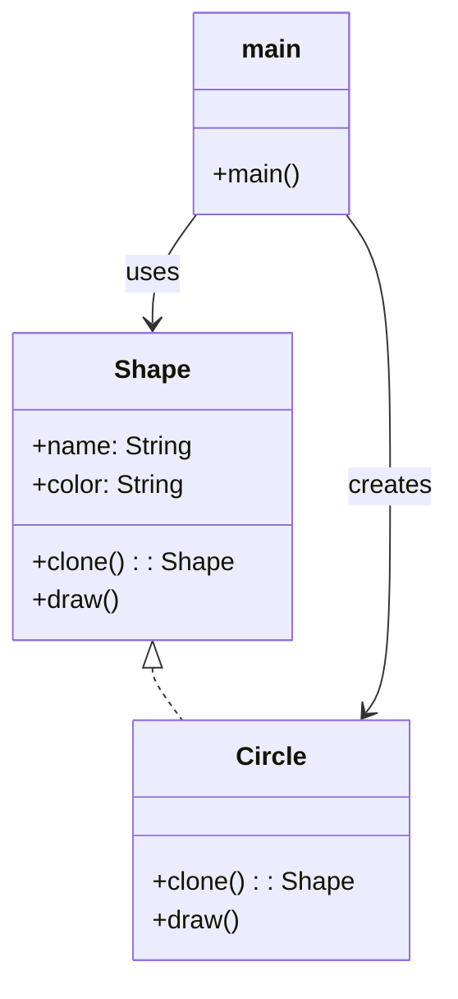

# Prototype Pattern

## 🧠 프로토타입 패턴이란?
객체를 직접 생성하지 않고, **기존 객체를 복제(clone)**해서 새로운 객체를 만드는 생성 패턴입니다.
복잡한 초기화 과정을 피하고, 런타임에 객체를 유연하게 생성할 수 있게 해줍니다.


## 🦀 Rust 예제
```rust
#[derive(Debug, Clone)]
struct Shape {
    name: String,
    color: String,
}

impl Shape {
    fn new(name: &str, color: &str) -> Self {
        Self {
            name: name.to_string(),
            color: color.to_string(),
        }
    }

    fn clone_box(&self) -> Box<Shape> {
        Box::new(self.clone())
    }
}

fn main() {
    let original = Shape::new("Circle", "Red");
    let copy = original.clone_box();

    println!("Original: {:?}", original);
    println!("Copy: {:?}", copy);
}
```

- Clone 트레이트를 활용해 복제
- Box<Shape>로 힙에 저장된 객체를 반환

## 🧱 C++ 예제
```cpp
#include <iostream>
#include <memory>

class Shape {
public:
    virtual std::unique_ptr<Shape> clone() const = 0;
    virtual void draw() const = 0;
    virtual ~Shape() {}
};

class Circle : public Shape {
public:
    std::unique_ptr<Shape> clone() const override {
        return std::make_unique<Circle>(*this);
    }
    void draw() const override {
        std::cout << "Drawing Circle\n";
    }
};

int main() {
    std::unique_ptr<Shape> original = std::make_unique<Circle>();
    std::unique_ptr<Shape> copy = original->clone();

    original->draw();
    copy->draw();
}
```

- clone()은 가상 함수
- unique_ptr로 소유권 관리

## 🧱 C# 예제
```csharp
using System;

public interface IShape {
    IShape Clone();
    void Draw();
}

public class Circle : IShape {
    public string Color { get; set; }

    public IShape Clone() {
        return new Circle { Color = this.Color };
    }

    public void Draw() {
        Console.WriteLine($"Drawing Circle with color {Color}");
    }
}

class Program {
    static void Main() {
        IShape original = new Circle { Color = "Red" };
        IShape copy = original.Clone();

        original.Draw();
        copy.Draw();
    }
}
```

- Clone() 메서드로 복제
- interface 기반 다형성

## 🐍 Python 예제
```python
import copy

class Shape:
    def __init__(self, name, color):
        self.name = name
        self.color = color

    def clone(self):
        return copy.deepcopy(self)

    def draw(self):
        print(f"Drawing {self.name} with color {self.color}")

original = Shape("Circle", "Red")
copy_shape = original.clone()

original.draw()
copy_shape.draw()
```

- copy.deepcopy()로 복제
- 클래스 내부에 clone() 메서드 정의

## 🧩 Mermaid 클래스 다이어그램



## 📌 요약 비교
| 언어      | 복제 방식           | 추상화 방식         | 메모리 관리 방식     |
|-----------|---------------------|----------------------|----------------------|
| **Rust**  | `Clone`             | `Box<T>`             | 소유권 기반 자동 관리 |
| **C++**   | `virtual clone()`   | `abstract class`     | `unique_ptr` 기반 수동 관리 |
| **C#**    | `IShape.Clone()`    | `interface`          | GC 기반 자동 관리     |
| **Python**| `copy.deepcopy()`   | 클래스 기반          | 동적 타입 + 자동 관리 |

---


