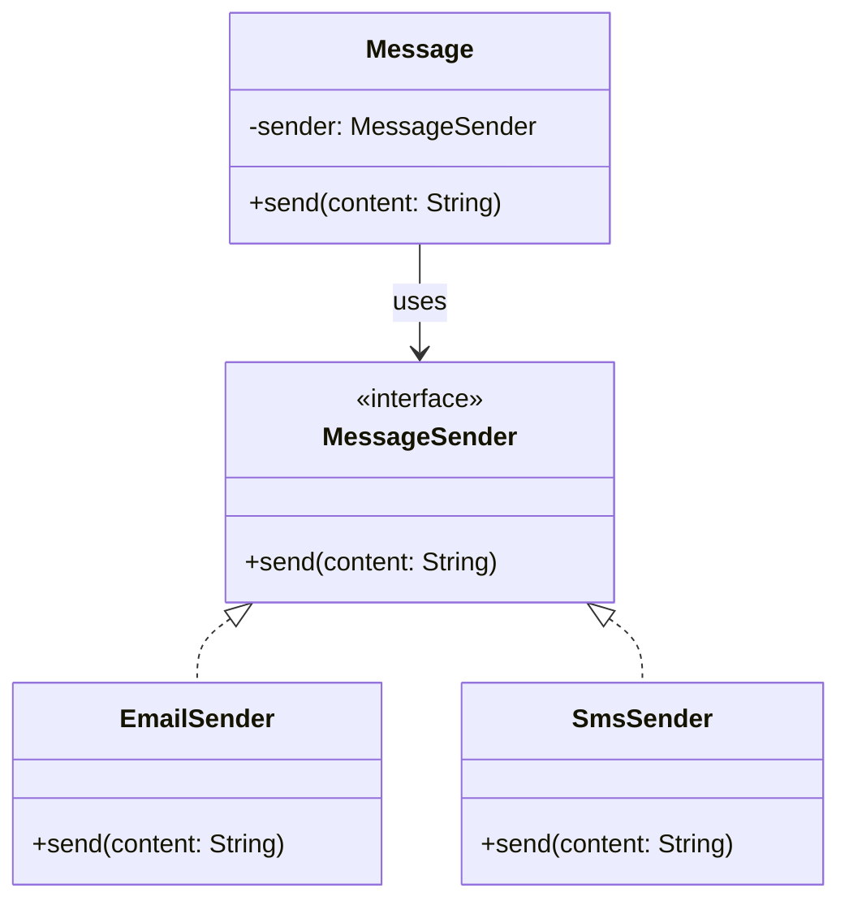

# Bridge Pattern

## 🧠 브리지 패턴이란?
기능 계층(Abstraction)과 구현 계층(Implementation)을 분리하여
서로 독립적으로 확장할 수 있게 해주는 구조 패턴입니다.

### 예: 메시지를 전송하는 시스템에서
- 기능 계층: Message (텍스트, 알림 등)
- 구현 계층: Sender (SMS, Email 등)

## 🦀 Rust 예제
```rust
trait MessageSender {
    fn send(&self, content: &str);
}

struct EmailSender;
impl MessageSender for EmailSender {
    fn send(&self, content: &str) {
        println!("Sending Email: {}", content);
    }
}

struct SmsSender;
impl MessageSender for SmsSender {
    fn send(&self, content: &str) {
        println!("Sending SMS: {}", content);
    }
}

struct Message<'a> {
    sender: &'a dyn MessageSender,
}

impl<'a> Message<'a> {
    fn new(sender: &'a dyn MessageSender) -> Self {
        Self { sender }
    }

    fn send(&self, content: &str) {
        self.sender.send(content);
    }
}

fn main() {
    let email = EmailSender;
    let sms = SmsSender;

    let msg1 = Message::new(&email);
    let msg2 = Message::new(&sms);

    msg1.send("Hello via Email!");
    msg2.send("Hello via SMS!");
}
```

### ✅ Rust 구조 설명
| 구성 요소             | 설명                                 |
|----------------------|--------------------------------------|
| `trait MessageSender`| 구현 계층의 추상화. `send()` 메서드 정의 |
| `EmailSender`, `SmsSender` | 구현 계층의 구체 타입. `MessageSender`를 구현 |
| `struct Message<'a>` | 기능 계층. 구현체를 참조하여 메시지 전송 |
| `&'a dyn MessageSender` | 브리지 연결. 런타임에 구현을 주입하는 참조 |


- Rust는 상속 대신 trait + 참조로 브리지를 연결
- Message는 MessageSender를 참조하여 구현에 의존하지 않음
- 런타임에 구현을 바꿔 끼울 수 있음

## 🧱 C++ 예제
```cpp
#include <iostream>
#include <memory>

class MessageSender {
public:
    virtual void send(const std::string& content) = 0;
    virtual ~MessageSender() {}
};

class EmailSender : public MessageSender {
public:
    void send(const std::string& content) override {
        std::cout << "Sending Email: " << content << "\n";
    }
};

class SmsSender : public MessageSender {
public:
    void send(const std::string& content) override {
        std::cout << "Sending SMS: " << content << "\n";
    }
};

class Message {
protected:
    std::shared_ptr<MessageSender> sender;
public:
    Message(std::shared_ptr<MessageSender> s) : sender(s) {}
    void send(const std::string& content) {
        sender->send(content);
    }
};

int main() {
    auto email = std::make_shared<EmailSender>();
    auto sms = std::make_shared<SmsSender>();

    Message msg1(email);
    Message msg2(sms);

    msg1.send("Hello via Email!");
    msg2.send("Hello via SMS!");
}
```


## 🧱 C# 예제
```csharp
public interface IMessageSender {
    void Send(string content);
}

public class EmailSender : IMessageSender {
    public void Send(string content) => Console.WriteLine($"Sending Email: {content}");
}

public class SmsSender : IMessageSender {
    public void Send(string content) => Console.WriteLine($"Sending SMS: {content}");
}

public class Message {
    private IMessageSender sender;
    public Message(IMessageSender sender) {
        this.sender = sender;
    }

    public void Send(string content) {
        sender.Send(content);
    }
}

class Program {
    static void Main() {
        var email = new EmailSender();
        var sms = new SmsSender();

        var msg1 = new Message(email);
        var msg2 = new Message(sms);

        msg1.Send("Hello via Email!");
        msg2.Send("Hello via SMS!");
    }
}
```


## 🐍 Python 예제
```python
class MessageSender:
    def send(self, content):
        raise NotImplementedError

class EmailSender(MessageSender):
    def send(self, content):
        print(f"Sending Email: {content}")

class SmsSender(MessageSender):
    def send(self, content):
        print(f"Sending SMS: {content}")

class Message:
    def __init__(self, sender: MessageSender):
        self.sender = sender

    def send(self, content):
        self.sender.send(content)

email = EmailSender()
sms = SmsSender()

msg1 = Message(email)
msg2 = Message(sms)

msg1.send("Hello via Email!")
msg2.send("Hello via SMS!")
```


## 🧩 Mermaid 클래스 다이어그램 (공통 구조)



## 📌 요약 비교
| 언어      | 추상화 방식         | 구현 연결 방식       | 메모리 관리 방식     |
|-----------|---------------------|-----------------------|----------------------|
| **Rust**  | `trait`             | `&dyn Trait`          | 소유권 기반 자동 관리 |
| **C++**   | `abstract class`    | `shared_ptr`          | 스마트 포인터 기반 수동 관리 |
| **C#**    | `interface`         | 생성자 주입           | GC 기반 자동 관리     |
| **Python**| 클래스 기반         | 동적 바인딩           | 자동 관리 (동적 타입) |

--- 

## 🎯 패턴을 구별하는 핵심 기준
| 패턴 이름         | 핵심 목적                         | 구조적 특징                        | 대표 키워드 / 메서드 |
|------------------|-----------------------------------|------------------------------------|------------------------|
| **Bridge**       | 기능과 구현을 분리하여 독립 확장   | 기능 계층 ↔ 구현 계층 연결         | `&dyn Trait`, `shared_ptr` |
| **Strategy**     | 알고리즘을 런타임에 교체           | 인터페이스 기반 알고리즘 교체      | `set_strategy()`, `execute()` |
| **Adapter**      | 인터페이스 변환으로 호환성 확보    | 기존 객체를 감싸서 인터페이스 변경 | `adapt()`, `convert()` |
| **Decorator**    | 기능을 동적으로 확장               | 원래 객체를 감싸는 구조             | `wrap()`, `enhance()` |
| **Prototype**    | 객체를 복제하여 생성               | `clone()` 기반 복제                | `clone()`, `deepcopy()` |
| **Factory Method**| 객체 생성 책임을 서브클래스로 위임 | 팩토리 메서드로 객체 생성          | `create()`, `new_instance()` |


## 🧠 기억하기 쉬운 비유
- Strategy: “같은 목적, 다른 방법” → 정렬 알고리즘 바꾸기
- Bridge: “같은 기능, 다른 구현” → 메시지를 Email/SMS로 보내기
- Decorator: “같은 객체, 기능 추가” → 커피에 시럽 추가
- Adapter: “다른 인터페이스, 호환시키기” → 220V → 110V 변환기
- Prototype: “복사해서 새로 만들기” → 복제인간
- Abstract Factory: “제품군을 한 번에 만들기” → Windows UI vs Mac UI

## 💡 나만의 정리법 제안
- 패턴 이름을 외우기보다 → “이 코드가 어떤 문제를 해결하려고 하는가?”에 집중
- 예를 들어,
- “이 객체가 기능을 확장하려고 감싸고 있네?” → Decorator
- “이 객체가 다른 인터페이스로 바꿔주네?” → Adapter
- “이 기능이 구현체를 참조하고 있네?” → Bridge
- “이 알고리즘을 바꿔 끼우네?” → Strategy

---

# 소유권 문제 

## 🧠 현재 구조: 단일 소유
struct Message {
    sender: Box<dyn MessageSender>,
}


- Box<T>는 단일 소유권을 갖는 스마트 포인터입니다
- 즉, Message가 sender를 소유하고 있고
- 다른 곳에서 이 sender를 공유하려면 move하거나 참조해야 해요

## 🔄 여러 곳에서 공유하고 싶다면?
### 1. Rc<dyn Trait> (단일 스레드 공유)
```rust
use std::rc::Rc;

struct Message {
    sender: Rc<dyn MessageSender>,
}
```

- 여러 Message 인스턴스가 같은 sender를 공유 가능
- 단점: 스레드 안전하지 않음

### 2. Arc<dyn Trait> (멀티 스레드 공유)
```rust
use std::sync::Arc;

struct Message {
    sender: Arc<dyn MessageSender + Send + Sync>,
}
```


- 여러 스레드에서 안전하게 공유 가능
- Send + Sync 트레이트 바운드 필요

### 🔍 예시: 여러 메시지가 같은 Sender를 공유
```rust
fn main() {
    let shared_sender = Arc::new(EmailSender);

    let msg1 = Message { sender: shared_sender.clone() };
    let msg2 = Message { sender: shared_sender.clone() };

    msg1.send("Hello from msg1");
    msg2.send("Hello from msg2");
}
```

- Arc::clone()은 참조 카운트만 증가시키므로 비용이 적음
- EmailSender는 하나만 생성되고, 여러 메시지가 공유

## 📌 요약
| 포인터 타입 | 소유 방식     | 공유 가능성       | 스레드 안전성 | 주요 용도                     |
|-------------|---------------|-------------------|----------------|-------------------------------|
| `Box<T>`    | 단일 소유     | ❌ 공유 불가       | ✅ 안전         | 값의 힙 저장, 런타임 다형성 (`dyn Trait`)  
| `Rc<T>`     | 참조 카운트   | ✅ 단일 스레드 공유 | ❌ 비안전       | 여러 객체가 같은 값을 공유 (싱글 스레드)  
| `Arc<T>`    | 참조 카운트   | ✅ 멀티 스레드 공유 | ✅ 안전         | 스레드 간 안전한 공유 (멀티 스레드 환경)  


## 🧠 Send와 Sync의 의미
| Trait  | 의미                                |
|--------|-------------------------------------|
| `Send` | 값을 다른 스레드로 `move`할 수 있음 |
| `Sync` | 참조(`&T`)를 여러 스레드에서 공유 가능 |


## 🔍 왜 dyn Trait + Send + Sync가 필요한가?
예: Arc<dyn MessageSender + Send + Sync>
```rust
use std::sync::Arc;

fn spawn_sender(sender: Arc<dyn MessageSender + Send + Sync>) {
    std::thread::spawn(move || {
        sender.send("Hello from thread!");
    });
}
```

- Arc<T>는 스레드 간 공유를 위해 T: Send + Sync가 필요함
- dyn Trait은 기본적으로 Send나 Sync가 없음
- 따라서 명시적으로 + Send + Sync를 붙여야 컴파일됨

### ❗ 안 붙이면 생기는 문제
```rust
let sender: Arc<dyn MessageSender> = Arc::new(EmailSender);
std::thread::spawn(move || {
    sender.send("Hi");
});
```

- 컴파일 에러: dyn MessageSender는 Send가 구현되지 않았다고 나옴
- 해결 방법: Arc<dyn MessageSender + Send + Sync>

## 📌 요약
| 동작 / 타입       | 요구되는 Trait       |
|------------------|----------------------|
| `move`           | `Send`               |
| `&T`             | `Sync`               |
| `Arc<T>`         | `T: Send + Sync`     |
| `dyn Trait`      | `Send + Sync` 명시 필요 |


## 🧠 핵심 이유: dyn Trait은 기본적으로 Send와 Sync가 없음
- Rust에서 Send와 Sync는 auto trait입니다
→ 모든 필드가 Send/Sync이면 자동으로 구현됨
- 하지만 dyn Trait은 trait object이기 때문에
→ 컴파일러는 해당 trait이 Send/Sync를 구현했는지 알 수 없음
즉, dyn Trait은 구체 타입이 어떤 것인지 알 수 없기 때문에
스레드 안전성을 보장할 수 없고,
명시적으로 + Send + Sync를 붙여야만 스레드 간 이동/공유가 가능해져요.

## 🔍 예시: 왜 명시가 필요할까?
```rust
use std::sync::Arc;

trait MessageSender {
    fn send(&self, msg: &str);
}

struct EmailSender;
impl MessageSender for EmailSender {
    fn send(&self, msg: &str) {
        println!("Email: {}", msg);
    }
}

fn main() {
    let sender: Arc<dyn MessageSender> = Arc::new(EmailSender);
    std::thread::spawn(move || {
        sender.send("Hello");
    });
}
```

###  ❌ 컴파일 에러 발생:
dyn MessageSender doesn't implement Send

### ✅ 해결 방법:
let sender: Arc<dyn MessageSender + Send + Sync> = Arc::new(EmailSender);


## 📌 요약
| 개념               | 요구되는 Trait         |
|--------------------|------------------------|
| `SendSync`         | 스레드 간 이동 및 공유 |
| `dyn Trait`        | `Send + Sync` 명시 필요 |
| `Arc<dyn Trait>`   | `+ Send + Sync` 필요    |

