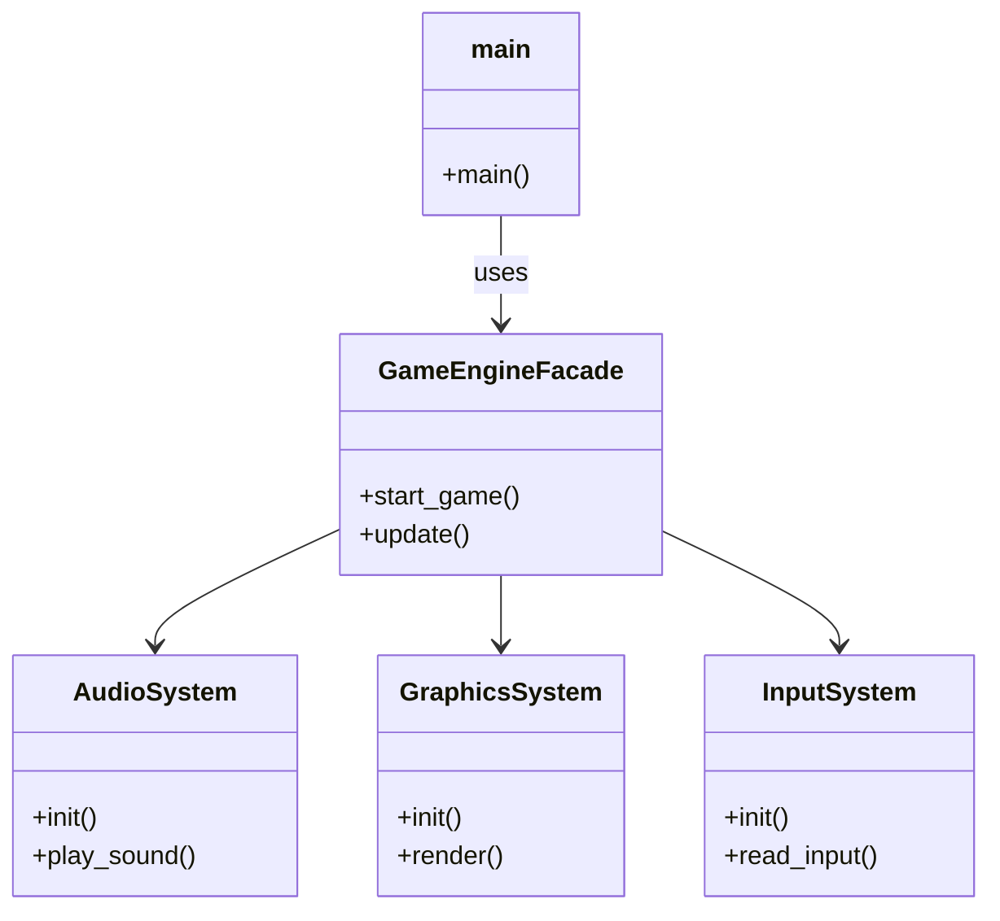
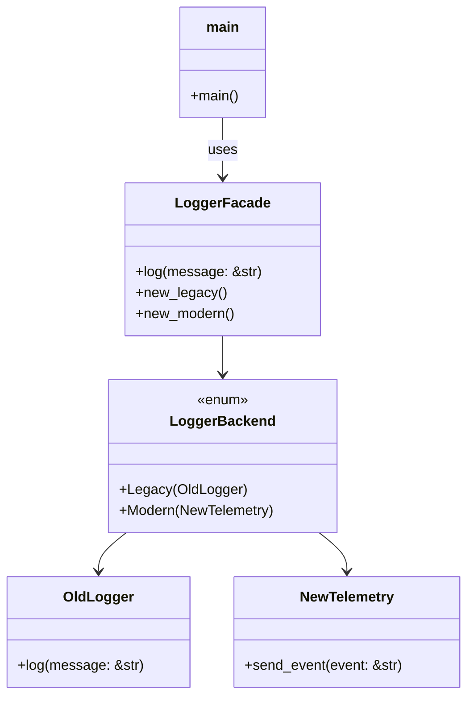

# Facade

## 🧠 퍼사드 패턴이란?
복잡한 서브시스템을 감싸고, 단순한 인터페이스만 외부에 제공하는 구조 패턴입니다.
클라이언트는 내부 구현을 몰라도 퍼사드만 통해 시스템을 사용할 수 있어요.


## 🦀 Rust 예제
```rust
// 서브 시스템 1
struct AudioSystem;
impl AudioSystem {
    fn init(&self) {
        println!("Audio system initialized");
    }
    fn play_sound(&self) {
        println!("Playing sound");
    }
}

// 서브 시스템 2
struct GraphicsSystem;
impl GraphicsSystem {
    fn init(&self) {
        println!("Graphics system initialized");
    }
    fn render(&self) {
        println!("Rendering graphics");
    }
}

// 서브 시스템 3
struct InputSystem;
impl InputSystem {
    fn init(&self) {
        println!("Input system initialized");
    }
    fn read_input(&self) {
        println!("Reading user input");
    }
}

// 퍼사드
struct GameEngineFacade {
    audio: AudioSystem,
    graphics: GraphicsSystem,
    input: InputSystem,
}

impl GameEngineFacade {
    fn new() -> Self {
        Self {
            audio: AudioSystem,
            graphics: GraphicsSystem,
            input: InputSystem,
        }
    }

    fn start_game(&self) {
        self.audio.init();
        self.graphics.init();
        self.input.init();
        println!("Game started!");
    }

    fn update(&self) {
        self.input.read_input();
        self.audio.play_sound();
        self.graphics.render();
    }
}

// 메인
fn main() {
    let engine = GameEngineFacade::new();
    engine.start_game();
    engine.update();
}
```

## 🧱 C++ 예제
```cpp
#include <iostream>

class AudioSystem {
public:
    void init() { std::cout << "Audio system initialized\n"; }
    void play() { std::cout << "Playing sound\n"; }
};

class GraphicsSystem {
public:
    void init() { std::cout << "Graphics system initialized\n"; }
    void render() { std::cout << "Rendering graphics\n"; }
};

class InputSystem {
public:
    void init() { std::cout << "Input system initialized\n"; }
    void read() { std::cout << "Reading input\n"; }
};

class GameEngineFacade {
    AudioSystem audio;
    GraphicsSystem graphics;
    InputSystem input;
public:
    void startGame() {
        audio.init();
        graphics.init();
        input.init();
        std::cout << "Game started!\n";
    }

    void update() {
        input.read();
        audio.play();
        graphics.render();
    }
};

int main() {
    GameEngineFacade engine;
    engine.startGame();
    engine.update();
}
```


## 🧱 C# 예제
```csharp
using System;

class AudioSystem {
    public void Init() => Console.WriteLine("Audio system initialized");
    public void Play() => Console.WriteLine("Playing sound");
}

class GraphicsSystem {
    public void Init() => Console.WriteLine("Graphics system initialized");
    public void Render() => Console.WriteLine("Rendering graphics");
}

class InputSystem {
    public void Init() => Console.WriteLine("Input system initialized");
    public void Read() => Console.WriteLine("Reading input");
}

class GameEngineFacade {
    private AudioSystem audio = new AudioSystem();
    private GraphicsSystem graphics = new GraphicsSystem();
    private InputSystem input = new InputSystem();

    public void StartGame() {
        audio.Init();
        graphics.Init();
        input.Init();
        Console.WriteLine("Game started!");
    }

    public void Update() {
        input.Read();
        audio.Play();
        graphics.Render();
    }
}

class Program {
    static void Main() {
        var engine = new GameEngineFacade();
        engine.StartGame();
        engine.Update();
    }
}
```


🧩 Mermaid 클래스 다이어그램 (Rust 구조 기반)



## ✅ Rust 구조 요약
| 구성 요소          | 역할 설명                                      |
|-------------------|------------------------------------------------|
| `AudioSystem`     | 사운드 초기화 및 재생을 담당하는 서브 시스템   |
| `GraphicsSystem`  | 그래픽 초기화 및 렌더링을 담당하는 서브 시스템 |
| `InputSystem`     | 사용자 입력 초기화 및 처리 담당 서브 시스템     |
| `GameEngineFacade`| 모든 서브 시스템을 감싸고 단순한 인터페이스 제공 |
| `main()`          | 클라이언트 코드. 퍼사드를 통해 게임 실행 및 업데이트 |

---


## 🎯 퍼사드의 핵심 목적 보강
| 핵심 목적       | 설명                                                         |
|----------------|--------------------------------------------------------------|
| 단순화         | 복잡한 서브시스템을 감추고, 단순한 인터페이스만 외부에 제공 |
| 호환성 유지     | 기존 클라이언트 코드를 변경하지 않고 내부 구현을 교체 가능  |
| 캡슐화         | 내부 시스템의 세부 구현을 외부로부터 보호                   |
| 확장성 확보     | 새로운 기능을 퍼사드 내부에 추가 가능, 외부 인터페이스는 유지 |
| 테스트 용이성   | 퍼사드만 테스트하면 전체 시스템 흐름을 검증할 수 있음       |


### 🔍 예시로 풀어보면
```rust
// 기존 퍼사드
fn start_game() {
    audio.init();
    graphics.init();
    input.init();
}

// 내부 시스템 교체
fn start_game() {
    new_audio.setup();
    new_graphics.boot();
    input.init(); // 유지
}
```

- 외부에서 start_game()을 호출하는 코드는 변경 없음
- 내부에서는 AudioSystem을 NewAudioSystem으로 교체 가능
- 즉, 퍼사드는 **“동작은 그대로, 구현은 바꾼다”**를 가능하게 해주는 구조

### 💡 그래서 퍼사드는 “레거시 보호 + 확장”에 강력함
- API를 외부에 고정시켜 놓고
- 내부는 최신 시스템으로 교체하거나, 테스트용 모듈로 바꾸거나
- 심지어 여러 시스템을 조합해서 새로운 동작을 만들 수도 있음


아래는 퍼사드 패턴을 활용해 레거시 로깅 시스템(OldLogger)을 감싸고,
새로운 텔레메트리 시스템(NewTelemetry)으로 교체 가능한 구조를
Rust로 구현한 실전 시나리오입니다.

## 🧱 시나리오 개요
- 기존 시스템은 OldLogger를 사용해 로그를 출력함
- 새로운 시스템은 NewTelemetry를 사용해 로그를 전송함
- 클라이언트는 LoggerFacade만 사용 → 내부 구현은 자유롭게 교체 가능

### 🦀 Rust 코드 예제
```rust
// 레거시 로거
struct OldLogger;
impl OldLogger {
    fn log(&self, message: &str) {
        println!("[OldLogger] {}", message);
    }
}

// 새로운 텔레메트리 시스템
struct NewTelemetry;
impl NewTelemetry {
    fn send_event(&self, event: &str) {
        println!("[NewTelemetry] Event sent: {}", event);
    }
}

// 퍼사드
enum LoggerBackend {
    Legacy(OldLogger),
    Modern(NewTelemetry),
}

struct LoggerFacade {
    backend: LoggerBackend,
}

impl LoggerFacade {
    fn new_legacy() -> Self {
        Self {
            backend: LoggerBackend::Legacy(OldLogger),
        }
    }

    fn new_modern() -> Self {
        Self {
            backend: LoggerBackend::Modern(NewTelemetry),
        }
    }

    fn log(&self, message: &str) {
        match &self.backend {
            LoggerBackend::Legacy(logger) => logger.log(message),
            LoggerBackend::Modern(telemetry) => telemetry.send_event(message),
        }
    }
}

// 클라이언트 코드
fn main() {
    let legacy_logger = LoggerFacade::new_legacy();
    legacy_logger.log("Starting with legacy logger");

    let modern_logger = LoggerFacade::new_modern();
    modern_logger.log("Switching to telemetry system");
}
```


## ✅ 구조 설명
| 구성 요소        | 역할 설명                                      |
|------------------|------------------------------------------------|
| `OldLogger`      | 레거시 로깅 시스템. `println!`으로 로그 출력     |
| `NewTelemetry`   | 새로운 이벤트 기반 로깅 시스템                   |
| `LoggerBackend`  | 내부 구현을 감싸는 `enum` 타입 (`Legacy` / `Modern`) |
| `LoggerFacade`   | 클라이언트에게 단일 `log()` 인터페이스 제공     |
| `main()`         | 퍼사드를 통해 로깅 기능을 사용하는 클라이언트 코드 |


## 🧩 Mermaid 클래스 다이어그램



## 💡 핵심 포인트
- 클라이언트는 LoggerFacade만 사용 → 내부가 OldLogger든 NewTelemetry든 상관 없음
- 내부 구현은 enum으로 캡슐화 → 런타임에 선택 가능
- 새로운 시스템으로 교체해도 기존 인터페이스(log())는 그대로 유지

---
