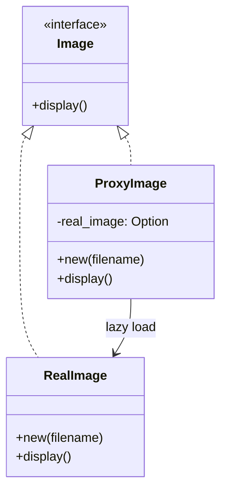

# Proxy

**프록시 패턴 (Proxy Pattern)** 은 단순한 대리 객체를 넘어서,
캐싱, 접근 제어, 지연 로딩, 로깅, 원격 호출까지 다양한 기능을 중간에서 처리할 수 있는 강력한 구조적 패턴입니다.

## 🧠 핵심 개념 요약
| 프록시 유형       | 주요 목적 및 기능 설명                         |
|------------------|-----------------------------------------------|
| 가상 프록시       | Lazy Loading: 실제 객체 생성을 지연시켜 성능 최적화 |
| 보호 프록시       | 접근 제어: 인증, 권한 확인 등 보안 처리           |
| 캐시 프록시       | 결과 저장: 중복 호출 방지, 성능 향상              |
| 스마트 프록시     | 로깅, 트랜잭션, 참조 횟수 추적 등 부가 기능 추가   |
| 원격 프록시       | 네트워크를 통한 원격 객체 접근 (RPC 등)           |


## 🦀 Rust 예제: 이미지 로딩 프록시 (지연 + 캐시 + 로깅)
```rust
trait Image {
    fn display(&self);
}

// 실제 이미지 객체
struct RealImage {
    filename: String,
}

impl RealImage {
    fn new(filename: &str) -> Self {
        println!("Loading image from disk: {}", filename);
        Self {
            filename: filename.to_string(),
        }
    }
}

impl Image for RealImage {
    fn display(&self) {
        println!("Displaying image: {}", self.filename);
    }
}

// 프록시 객체
struct ProxyImage {
    filename: String,
    real_image: Option<RealImage>,
}

impl ProxyImage {
    fn new(filename: &str) -> Self {
        Self {
            filename: filename.to_string(),
            real_image: None,
        }
    }
}

impl Image for ProxyImage {
    fn display(&self) {
        println!("Proxy: Checking cache and permissions...");
        let mut image = self.real_image.clone();
        if image.is_none() {
            image = Some(RealImage::new(&self.filename));
        }
        image.as_ref().unwrap().display();
    }
}

fn main() {
    let proxy = ProxyImage::new("test.jpg");
    // 첫 호출: 실제 이미지 로딩 발생
    proxy.display();
    // 두 번째 호출: 캐시된 이미지 사용
    proxy.display();
}

```

이 예제는 RealImage를 실제로 로딩하기 전에 ProxyImage가
캐시 확인, 로딩 지연, 로깅을 수행하는 구조입니다.


## 🧱 C++ 예제
```cpp
#include <iostream>
#include <memory>
#include <string>

class Image {
public:
    virtual void display() = 0;
};

class RealImage : public Image {
    std::string filename;
public:
    RealImage(const std::string& fname) : filename(fname) {
        std::cout << "Loading image: " << filename << "\n";
    }
    void display() override {
        std::cout << "Displaying image: " << filename << "\n";
    }
};

class ProxyImage : public Image {
    std::string filename;
    std::unique_ptr<RealImage> realImage;
public:
    ProxyImage(const std::string& fname) : filename(fname) {}
    void display() override {
        std::cout << "Proxy: Checking access...\n";
        if (!realImage) {
            realImage = std::make_unique<RealImage>(filename);
        }
        realImage->display();
    }
};

int main() {
    ProxyImage proxy("test.jpg");
    proxy.display();
    proxy.display();
}
```


🧱 C# 예제
```csharp
using System;

interface IImage {
    void Display();
}

class RealImage : IImage {
    private string filename;
    public RealImage(string fname) {
        filename = fname;
        Console.WriteLine("Loading image: " + filename);
    }
    public void Display() {
        Console.WriteLine("Displaying image: " + filename);
    }
}

class ProxyImage : IImage {
    private string filename;
    private RealImage realImage;
    public ProxyImage(string fname) {
        filename = fname;
    }
    public void Display() {
        Console.WriteLine("Proxy: Checking access...");
        if (realImage == null) {
            realImage = new RealImage(filename);
        }
        realImage.Display();
    }
}

class Program {
    static void Main() {
        IImage image = new ProxyImage("test.jpg");
        image.Display();
        image.Display();
    }
}
```


## 🐍 Python 예제
```python
class Image:
    def display(self):
        pass

class RealImage(Image):
    def __init__(self, filename):
        self.filename = filename
        print(f"Loading image: {filename}")
    def display(self):
        print(f"Displaying image: {self.filename}")

class ProxyImage(Image):
    def __init__(self, filename):
        self.filename = filename
        self.real_image = None
    def display(self):
        print("Proxy: Checking access...")
        if self.real_image is None:
            self.real_image = RealImage(self.filename)
        self.real_image.display()

if __name__ == "__main__":
    image = ProxyImage("test.jpg")
    image.display()
    image.display()
```


## 🧩 Mermaid 클래스 다이어그램 (Rust 구조 기반)



## ✅ Rust 구조 요약
| 구성 요소     | 역할 설명                                       |
|---------------|------------------------------------------------|
| `Image`       | 공통 인터페이스 (`display`)                     |
| `RealImage`   | 실제 이미지 로딩 및 표시                        |
| `ProxyImage`  | 프록시: 지연 로딩, 캐시, 보안 처리 가능         |
| `main()`      | 클라이언트: 프록시를 통해 이미지 사용           |


---

## 🧠 Option<T> 주요 메서드 설명
| 메서드        | 설명                                                                 |
|---------------|----------------------------------------------------------------------|
| `is_some()`   | 값이 `Some`이면 `true`, 아니면 `false` 반환                          |
| `is_none()`   | 값이 `None`이면 `true`, 아니면 `false` 반환                          |
| `as_ref()`    | `Option<T>` → `Option<&T>`로 변환. 값은 소모하지 않고 참조만 얻음     |
| `as_mut()`    | `Option<T>` → `Option<&mut T>`로 변환. 가변 참조를 얻음               |
| `unwrap()`    | `Some` 값을 꺼냄. `None`이면 패닉 발생                                |
| `unwrap_or(x)`| `Some`이면 그 값을, `None`이면 `x`를 반환                             |
| `map(f)`      | `Some`이면 `f`를 적용한 결과를 `Some`으로 반환, `None`이면 그대로 `None` |
| `and_then(f)` | `Some`이면 `f`를 적용해 또 다른 `Option` 반환 (flatMap 느낌)          |
| `filter(p)`   | `Some`이고 조건 `p`를 만족하면 그대로, 아니면 `None` 반환             |


## 🔍 as_ref() 실전 예시
```rust
let text: Option<String> = Some("Hello".to_string());

// 값을 소모하지 않고 참조로 길이 계산
let len: Option<usize> = text.as_ref().map(|s| s.len());

println!("{:?}", text); // 여전히 Some("Hello")
```

→ as_ref()를 쓰면 text를 그대로 유지하면서 내부 값에 접근할 수 있어요.

---

## C++ unique_ptr 보강

C++에서 unique_ptr을 사용할 때 realImage->display()가 가능한 이유는
스마트 포인터가 operator->를 오버로드하고 있기 때문입니다.

## 🧠 핵심 개념: unique_ptr의 -> 연산자
- std::unique_ptr<T>는 내부적으로 T*를 감싸고 있음
- -> 연산자가 오버로드되어 있어서
→ unique_ptr<T> ptr;일 때 ptr->method()가 자동으로 get()을 호출한 것처럼 동작함
- 즉, realImage->display()는 내부적으로 realImage.get()->display()와 같음

## ✅ 예시 비교
```cpp
std::unique_ptr<RealImage> realImage = std::make_unique<RealImage>("test.jpg");

// 아래 두 줄은 동일하게 동작함
realImage->display();           // ✅ 권장 방식
realImage.get()->display();     // ✅ 가능하지만 덜 직관적
```
→ get()은 raw pointer를 직접 얻고 싶을 때만 사용하는 게 좋아요
→ 일반적인 메서드 호출은 ->로 충분하고, 더 안전하고 깔끔합니다

## 📌 요약 표
| 표현 방식              | 설명                                      |
|------------------------|-------------------------------------------|
| `realImage->display()` | 스마트 포인터의 `operator->`로 자동 연결됨 |
| `realImage.get()->display()` | raw pointer를 명시적으로 꺼내서 호출       |
| `get()` 사용 시 주의    | 소유권 없이 접근하므로 dangling 위험 있음   |

---


