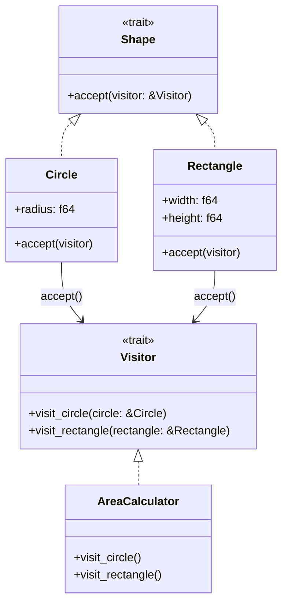

# Visitor

## 🧠 비지터 패턴이란?
객체 구조와 그 위에서 수행되는 작업을 분리하는 패턴입니다.
새로운 작업을 추가할 때 기존 객체 구조를 수정하지 않고도 확장할 수 있어요.


## 🦀 Rust 예제: Shape 구조에 AreaCalculator 비지터 적용
```rust
trait Shape {
    fn accept(&self, visitor: &dyn Visitor);
}

struct Circle {
    radius: f64,
}

struct Rectangle {
    width: f64,
    height: f64,
}

impl Shape for Circle {
    fn accept(&self, visitor: &dyn Visitor) {
        visitor.visit_circle(self);
    }
}

impl Shape for Rectangle {
    fn accept(&self, visitor: &dyn Visitor) {
        visitor.visit_rectangle(self);
    }
}

trait Visitor {
    fn visit_circle(&self, circle: &Circle);
    fn visit_rectangle(&self, rectangle: &Rectangle);
}

struct AreaCalculator;

impl Visitor for AreaCalculator {
    fn visit_circle(&self, circle: &Circle) {
        let area = std::f64::consts::PI * circle.radius * circle.radius;
        println!("Circle area: {:.2}", area);
    }

    fn visit_rectangle(&self, rectangle: &Rectangle) {
        let area = rectangle.width * rectangle.height;
        println!("Rectangle area: {:.2}", area);
    }
}

fn visit_all<T: Shape>(items: &[T], visitor: &dyn Visitor) {
    for item in items {
        item.accept(visitor);
    }
}

fn main() {
    let shapes: Vec<Box<dyn Shape>> = vec![
        Box::new(Circle { radius: 3.0 }),
        Box::new(Rectangle { width: 4.0, height: 5.0 }),
    ];

    let calculator = AreaCalculator;

    for shape in shapes {
        shape.accept(&calculator);
    }
}
```


## 🧱 C++ 예제
```cpp
#include <iostream>
#include <vector>
#include <memory>

class Circle;
class Rectangle;

class Visitor {
public:
    virtual void visit(Circle* c) = 0;
    virtual void visit(Rectangle* r) = 0;
};

class Shape {
public:
    virtual void accept(Visitor* v) = 0;
};

class Circle : public Shape {
public:
    double radius;
    Circle(double r) : radius(r) {}
    void accept(Visitor* v) override { v->visit(this); }
};

class Rectangle : public Shape {
public:
    double width, height;
    Rectangle(double w, double h) : width(w), height(h) {}
    void accept(Visitor* v) override { v->visit(this); }
};

class AreaCalculator : public Visitor {
public:
    void visit(Circle* c) override {
        std::cout << "Circle area: " << 3.14159 * c->radius * c->radius << "\n";
    }
    void visit(Rectangle* r) override {
        std::cout << "Rectangle area: " << r->width * r->height << "\n";
    }
};

int main() {
    std::vector<std::unique_ptr<Shape>> shapes;
    shapes.push_back(std::make_unique<Circle>(3.0));
    shapes.push_back(std::make_unique<Rectangle>(4.0, 5.0));

    AreaCalculator calculator;
    for (auto& shape : shapes) {
        shape->accept(&calculator);
    }
}
```


## 🧱 C# 예제
```csharp
using System;
using System.Collections.Generic;

interface IVisitor {
    void Visit(Circle c);
    void Visit(Rectangle r);
}

interface IShape {
    void Accept(IVisitor visitor);
}

class Circle : IShape {
    public double Radius { get; }
    public Circle(double r) => Radius = r;
    public void Accept(IVisitor visitor) => visitor.Visit(this);
}

class Rectangle : IShape {
    public double Width { get; }
    public double Height { get; }
    public Rectangle(double w, double h) {
        Width = w; Height = h;
    }
    public void Accept(IVisitor visitor) => visitor.Visit(this);
}

class AreaCalculator : IVisitor {
    public void Visit(Circle c) =>
        Console.WriteLine($"Circle area: {Math.PI * c.Radius * c.Radius:F2}");
    public void Visit(Rectangle r) =>
        Console.WriteLine($"Rectangle area: {r.Width * r.Height:F2}");
}

class Program {
    static void Main() {
        List<IShape> shapes = new() {
            new Circle(3.0),
            new Rectangle(4.0, 5.0)
        };
        var calculator = new AreaCalculator();
        shapes.ForEach(s => s.Accept(calculator));
    }
}
```


## 🐍 Python 예제
```python
class Visitor:
    def visit_circle(self, circle): pass
    def visit_rectangle(self, rectangle): pass

class Shape:
    def accept(self, visitor): pass

class Circle(Shape):
    def __init__(self, radius):
        self.radius = radius
    def accept(self, visitor):
        visitor.visit_circle(self)

class Rectangle(Shape):
    def __init__(self, width, height):
        self.width = width
        self.height = height
    def accept(self, visitor):
        visitor.visit_rectangle(self)

class AreaCalculator(Visitor):
    def visit_circle(self, circle):
        area = 3.14159 * circle.radius ** 2
        print(f"Circle area: {area:.2f}")
    def visit_rectangle(self, rectangle):
        area = rectangle.width * rectangle.height
        print(f"Rectangle area: {area:.2f}")

if __name__ == "__main__":
    shapes = [Circle(3.0), Rectangle(4.0, 5.0)]
    calculator = AreaCalculator()
    for shape in shapes:
        shape.accept(calculator)
```


## 🧩 Mermaid 클래스 다이어그램 (Rust 구조 기반)


## ✅ Rust 구조 요약
| 구성 요소        | 역할 설명                                           |
|------------------|----------------------------------------------------|
| `Shape`          | 방문 가능한 요소의 공통 인터페이스 (`accept`)       |
| `Circle`, `Rectangle` | 실제 요소. `accept()`에서 `vis

---

# Visitor 패턴 장점

Visitor 패턴은 Java와 C#에서 특히 많이 쓰이는 이유가 있어요—이 언어들은 클래스 기반의 정적 타입 시스템을 갖고 있어서,
런타임에 instanceof나 switch로 타입 분기하는 대신 Visitor로 타입별 로직을 분리하는 게 훨씬 깔끔하고 확장성이 좋음.

## 🎯 Java / C#에서 Visitor 패턴이 많이 쓰이는 대표 사례
| 사용 분야             | 적용 예시 또는 대상 객체                          | 수행되는 작업 예시                  |
|----------------------|--------------------------------------------------|-------------------------------------|
| 컴파일러 / 파서       | `javac`의 AST 노드 (`AnnotationValue`, `Expr`)   | 타입 검사, 코드 생성, 최적화         |
| 문서 처리 시스템      | `Paragraph`, `Table`, `Image` 등 문서 요소        | `draw()`, `resize()`, `export()` 등 |
| UI 컴포넌트 렌더링    | `Button`, `Slider`, `TextBox` 등 위젯             | 렌더링, 이벤트 바인딩, 스타일 적용   |
| 게임 오브젝트 처리    | `Player`, `Enemy`, `Item`, `Terrain` 등           | 충돌 처리, AI 적용, 렌더링          |
| 재무/회계 시스템      | `Invoice`, `Transaction`, `TaxRecord` 등          | 세금 계산, 보고서 생성, 감사 처리    |


## 🧠 왜 Visitor가 적합한가?
- 객체 구조는 그대로 유지하면서
- 새로운 기능을 외부에서 추가 가능
- instanceof나 switch 없이 타입별 분기 처리 가능
- 특히 컬렉션에 다양한 타입이 섞여 있을 때 유용함

## 📌 실전 예시: 컴파일러에서의 Visitor
Java 컴파일러 javac는
- AnnotationValue라는 다양한 타입의 노드가 있고
- AnnotationValueVisitor가 각 타입에 대해 처리 로직을 갖고 있음
예를 들어:
```java
visitor.visit(ConstantValue);
visitor.visit(EnumValue);
visitor.visit(ArrayValue);
```

→ 새로운 타입이 추가되어도 Visitor만 확장하면 되므로
→ 기존 노드 구조는 건드리지 않아도 됨

---
