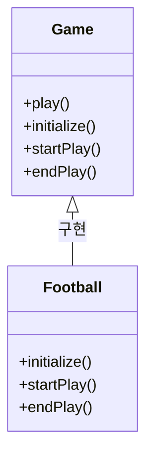

# Template Method Pattern

## 🧠 템플릿 메서드 패턴이란?
**템플릿 메서드 패턴 (Template Method Pattern)**은
상위 클래스에서 알고리즘의 구조(순서)를 정의하고,
세부 단계는 하위 클래스에서 구현하도록 하는 패턴입니다.
- 알고리즘의 공통된 흐름은 상위 클래스에 고정
- 변경 가능한 부분만 하위 클래스에서 오버라이딩
- 코드 재사용성과 유지보수성이 높아짐


## 🧪 언어별 구현 예시
###  🦀 Rust
Rust는 상속이 없기 때문에 트레이트와 디폴트 구현을 활용해 유사하게 구현합니다.
```rust
trait Game {
    fn play(&self) {
        self.initialize();
        self.start_play();
        self.end_play();
    }

    fn initialize(&self);
    fn start_play(&self);
    fn end_play(&self);
}

struct Football;

impl Game for Football {
    fn initialize(&self) { println!("축구 준비"); }
    fn start_play(&self) { println!("축구 시작"); }
    fn end_play(&self) { println!("축구 종료"); }
}

fn main() {
    let game = Football;
    game.play();
}
```

## 🟦 Java
```java
abstract class Game {
    public final void play() {
        initialize();
        startPlay();
        endPlay();
    }

    abstract void initialize();
    abstract void startPlay();
    abstract void endPlay();
}

class Football extends Game {
    void initialize() { System.out.println("축구 준비"); }
    void startPlay() { System.out.println("축구 시작"); }
    void endPlay() { System.out.println("축구 종료"); }
}

public class Main {
    public static void main(String[] args) {
        Game game = new Football();
        game.play();
    }
}
```


### 🐍 Python
```python
from abc import ABC, abstractmethod

class Game(ABC):
    def play(self):
        self.initialize()
        self.start_play()
        self.end_play()

    @abstractmethod
    def initialize(self): pass

    @abstractmethod
    def start_play(self): pass

    @abstractmethod
    def end_play(self): pass

class Football(Game):
    def initialize(self): print("축구 준비")
    def start_play(self): print("축구 시작")
    def end_play(self): print("축구 종료")

if __name__ == "__main__":
    game = Football()
    game.play()
```


### 🧊 C++
```cpp
#include <iostream>

class Game {
public:
    void play() {
        initialize();
        startPlay();
        endPlay();
    }

    virtual void initialize() = 0;
    virtual void startPlay() = 0;
    virtual void endPlay() = 0;
};

class Football : public Game {
public:
    void initialize() override { std::cout << "축구 준비\n"; }
    void startPlay() override { std::cout << "축구 시작\n"; }
    void endPlay() override { std::cout << "축구 종료\n"; }
};

int main() {
    Game* game = new Football();
    game->play();
    delete game;
}
```


### 🟪 C#
```csharp
using System;

abstract class Game {
    public void Play() {
        Initialize();
        StartPlay();
        EndPlay();
    }

    protected abstract void Initialize();
    protected abstract void StartPlay();
    protected abstract void EndPlay();
}

class Football : Game {
    protected override void Initialize() => Console.WriteLine("축구 준비");
    protected override void StartPlay() => Console.WriteLine("축구 시작");
    protected override void EndPlay() => Console.WriteLine("축구 종료");
}

class Program {
    static void Main() {
        Game game = new Football();
        game.Play();
    }
}
```

## 🧭 Mermaid 클래스 다이어그램



## ✅ 요약
| 언어     | 상속 방식     | 추상 메서드 표기       | 템플릿 메서드 구현 방식 |
|----------|---------------|------------------------|--------------------------|
| Rust     | 트레이트      | 디폴트 구현 또는 생략  | 트레이트 내부에서 순서 정의 |
| Java     | 클래스 상속   | `abstract`             | `final` 메서드로 순서 고정 |
| Python   | ABC 모듈      | `@abstractmethod`      | 일반 메서드에서 순서 호출 |
| C++      | 가상 함수     | `virtual`              | 일반 메서드에서 순서 호출 |
| C#       | 추상 클래스   | `abstract`             | `Play()` 메서드로 순서 고정 |

---


