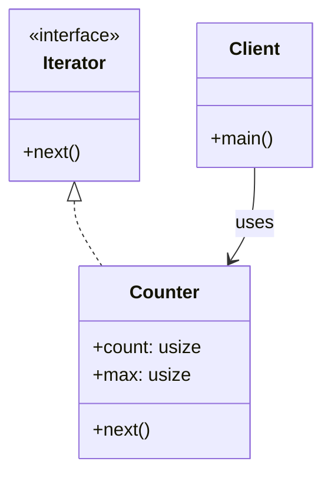
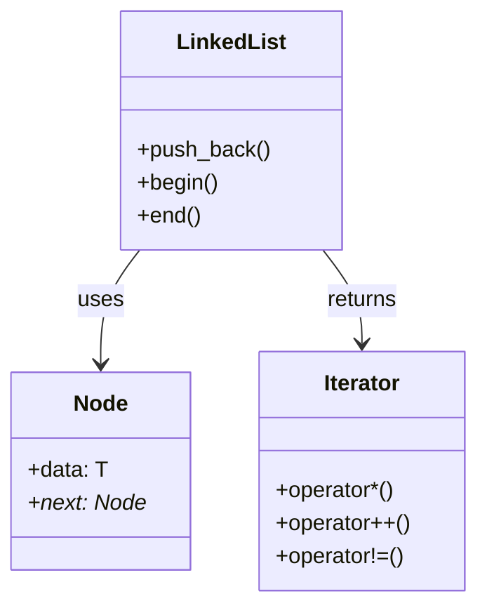

**반복자 패턴 (Iterator Pattern)**을 Rust를 중심으로, C++, C#, Python, Java까지 비교하며 설명해드릴게요. 마지막엔 구조를 시각화한 Mermaid 다이어그램도 포함할게요.

## 🧠 반복자 패턴이란?
반복자 패턴은 컬렉션의 내부 구조를 노출하지 않고, 그 요소들을 순차적으로 접근할 수 있게 해주는 디자인 패턴입니다.
### 🔑 핵심 구성 요소
- Iterator 인터페이스: hasNext(), next() 같은 순회 메서드 정의
- ConcreteIterator: 실제 순회 로직 구현
- Aggregate (컬렉션): 반복자를 생성하는 메서드 제공
- Client: 반복자를 통해 컬렉션을 순회

## 🦀 Rust에서의 반복자 패턴
Rust는 반복자 패턴을 언어 차원에서 강력하게 지원합니다. 
Iterator 트레이트를 통해 다양한 컬렉션을 순회할 수 있고, 커스텀 반복자도 쉽게 정의할 수 있어요.
### ✅ Rust 예제
```rust
struct Counter {
    count: usize,
    max: usize,
}

impl Counter {
    fn new(max: usize) -> Self {
        Counter { count: 0, max }
    }
}

impl Iterator for Counter {
    type Item = usize;

    fn next(&mut self) -> Option<Self::Item> {
        if self.count < self.max {
            let result = self.count;
            self.count += 1;
            Some(result)
        } else {
            None
        }
    }
}

fn main() {
    let counter = Counter::new(5);
    for num in counter {
        println!("숫자: {}", num);
    }
}
```

### 🔍 설명
- Counter는 커스텀 반복자
- Iterator 트레이트를 구현하여 next() 메서드 정의
- for 루프에서 자동으로 next() 호출됨

## 🌐 다른 언어에서의 반복자 패턴
### 🟦 Java
```java
import java.util.Iterator;
import java.util.ArrayList;

public class Main {
    public static void main(String[] args) {
        ArrayList<String> list = new ArrayList<>();
        list.add("A");
        list.add("B");

        Iterator<String> iter = list.iterator();
        while (iter.hasNext()) {
            System.out.println("값: " + iter.next());
        }
    }
}
```


## 🐍 Python
```python
class Counter:
    def __init__(self, max):
        self.count = 0
        self.max = max

    def __iter__(self):
        return self

    def __next__(self):
        if self.count < self.max:
            result = self.count
            self.count += 1
            return result
        else:
            raise StopIteration

counter = Counter(5)
for num in counter:
    print(f"숫자: {num}")
```


## 🧊 C++
```cpp
#include <iostream>
#include <vector>

int main() {
    std::vector<int> vec = {1, 2, 3};
    for (auto it = vec.begin(); it != vec.end(); ++it) {
        std::cout << "값: " << *it << std::endl;
    }
}
```


## 🟪 C#
```csharp
using System;
using System.Collections.Generic;

class Program {
    static void Main() {
        List<string> list = new List<string> { "A", "B" };
        foreach (var item in list) {
            Console.WriteLine("값: " + item);
        }
    }
}
```


## 🧭 Mermaid 클래스 다이어그램



## ✅ 요약 비교
| 언어     | 반복자 구현 방식             | 커스텀 반복자 지원 | 표준 컬렉션 순회 방식     |
|----------|------------------------------|--------------------|----------------------------|
| Rust     | `Iterator` 트레이트           | 있음               | `for` 루프 자동 호출       |
| Java     | `Iterator` 인터페이스         | 있음               | `iterator()` + `while`     |
| Python   | `__iter__()` + `__next__()`   | 있음               | `for` 루프 자동 호출       |
| C++      | `begin()` / `end()` 반복자    | 있음 (복잡함)      | `for` 또는 `auto` 반복자   |
| C#       | `IEnumerable` / `IEnumerator` | 있음               | `foreach` 자동 순회        |


---

# 반복자 패턴을 C++에서 직접 구현.

## 🧱 반복자 패턴 C++ 직접 구현 예제
###  🔹 구조 설명
- Node<T>: 연결 리스트의 노드
- LinkedList<T>: 컬렉션 클래스
- LinkedList<T>::Iterator: 내부 반복자 클래스
- main(): 반복자를 사용해 리스트 순회
### 🧩 코드 예시
```cpp
#include <iostream>

template <typename T>
struct Node {
    T data;
    Node* next;
    Node(const T& value) : data(value), next(nullptr) {}
};

template <typename T>
class LinkedList {
private:
    Node<T>* head;

public:
    LinkedList() : head(nullptr) {}

    void push_back(const T& value) {
        Node<T>* newNode = new Node<T>(value);
        if (!head) {
            head = newNode;
        } else {
            Node<T>* temp = head;
            while (temp->next) temp = temp->next;
            temp->next = newNode;
        }
    }

    class Iterator {
    private:
        Node<T>* current;

    public:
        Iterator(Node<T>* node) : current(node) {}

        T& operator*() { return current->data; }

        Iterator& operator++() {
            if (current) current = current->next;
            return *this;
        }

        bool operator!=(const Iterator& other) const {
            return current != other.current;
        }
    };

    Iterator begin() { return Iterator(head); }
    Iterator end() { return Iterator(nullptr); }
};

int main() {
    LinkedList<int> list;
    list.push_back(10);
    list.push_back(20);
    list.push_back(30);

    for (auto it = list.begin(); it != list.end(); ++it) {
        std::cout << "값: " << *it << std::endl;
    }

    return 0;
}
```


### 🧭 Mermaid 클래스 다이어그램



## ✅ 요점 정리
| 구성 요소       | 역할 또는 특징             |
|----------------|----------------------------|
| `Node<T>`       | 데이터 저장 및 연결 포인터 |
| `LinkedList<T>` | 컬렉션 관리 및 반복자 생성 |
| `Iterator`      | `*`, `++`, `!=` 연산자 오버로드로 순회 |
| `main()`        | 반복자를 통해 리스트 순회  |


