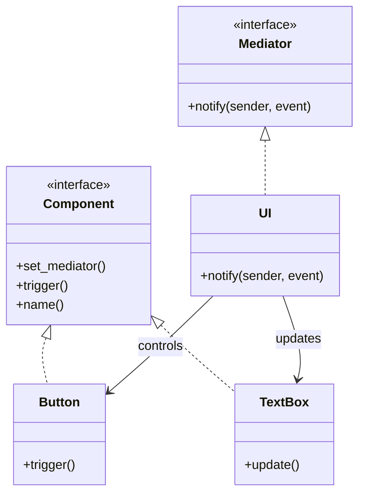

# Mediator
객체 간의 복잡한 상호작용을 깔끔하게 정리해주는 **중재자 패턴 (Mediator Pattern)**을 Rust를 중심으로, C++, C#, Python, Java까지 비교하며 설명.

## 🧠 중재자 패턴이란?
중재자 패턴은 여러 객체들이 서로 직접 통신하지 않고, 중재자(Mediator) 객체를 통해 간접적으로 소통하게 만드는 패턴입니다.
### 🔑 핵심 목적
- 객체 간 결합도를 낮춤
- 중앙 집중식 제어로 복잡한 상호작용을 단순화
- 유지보수성과 확장성 향상

## 🦀 Rust 기반 중재자 패턴 예제
Rust는 상속이 없기 때문에 트레이트와 구조체 조합으로 중재자 패턴을 구현합니다.
### 🔹 구조
- Mediator: 중재자 트레이트
- ConcreteMediator: 중재자 구현체
- Component: 구성원 트레이트
- Button, TextBox: 구성 요소
- main(): 상호작용 테스트

### 🧩 코드 예시
```rust
use std::rc::Rc;
use std::cell::RefCell;

trait Mediator {
    fn notify(&self, sender: &str, event: &str);
}

trait Component {
    fn set_mediator(&mut self, mediator: Rc<RefCell<dyn Mediator>>);
    fn trigger(&self);
    fn name(&self) -> &str;
}

struct Button {
    mediator: Option<Rc<RefCell<dyn Mediator>>>,
    label: String,
}

impl Button {
    fn new(label: &str) -> Self {
        Button { mediator: None, label: label.to_string() }
    }
}

impl Component for Button {
    fn set_mediator(&mut self, mediator: Rc<RefCell<dyn Mediator>>) {
        self.mediator = Some(mediator);
    }

    fn trigger(&self) {
        println!("Button '{}' clicked", self.label);
        if let Some(m) = &self.mediator {
            m.borrow().notify(&self.label, "click");
        }
    }

    fn name(&self) -> &str {
        &self.label
    }
}

struct TextBox {
    mediator: Option<Rc<RefCell<dyn Mediator>>>,
    name: String,
}

impl TextBox {
    fn new(name: &str) -> Self {
        TextBox { mediator: None, name: name.to_string() }
    }

    fn update(&self, text: &str) {
        println!("TextBox '{}' updated with '{}'", self.name, text);
    }
}

impl Component for TextBox {
    fn set_mediator(&mut self, mediator: Rc<RefCell<dyn Mediator>>) {
        self.mediator = Some(mediator);
    }

    fn trigger(&self) {
        println!("TextBox '{}' triggered", self.name);
    }

    fn name(&self) -> &str {
        &self.name
    }
}

struct UI {
    button: Rc<RefCell<Button>>,
    textbox: Rc<RefCell<TextBox>>,
}

impl UI {
    fn new(button: Rc<RefCell<Button>>, textbox: Rc<RefCell<TextBox>>) -> Self {
        UI { button, textbox }
    }
}

impl Mediator for UI {
    fn notify(&self, sender: &str, event: &str) {
        if sender == self.button.borrow().name() && event == "click" {
            self.textbox.borrow().update("Button was clicked!");
        }
    }
}

fn main() {
    let button = Rc::new(RefCell::new(Button::new("Submit")));
    let textbox = Rc::new(RefCell::new(TextBox::new("Status")));

    let mediator = Rc::new(RefCell::new(UI::new(button.clone(), textbox.clone())));

    button.borrow_mut().set_mediator(mediator.clone());
    textbox.borrow_mut().set_mediator(mediator.clone());

    button.borrow().trigger();
}
```

## 🧭 Mermaid 클래스 다이어그램




## 🌐 다른 언어에서의 중재자 패턴
### 🟦 Java
```java
interface Mediator {
    void notify(Component sender, String event);
}

abstract class Component {
    protected Mediator mediator;
    public void setMediator(Mediator mediator) {
        this.mediator = mediator;
    }
}

class Button extends Component {
    public void click() {
        System.out.println("Button clicked");
        mediator.notify(this, "click");
    }
}

class TextBox extends Component {
    public void update(String message) {
        System.out.println("TextBox updated: " + message);
    }
}

class UI implements Mediator {
    private Button button;
    private TextBox textbox;

    public UI(Button button, TextBox textbox) {
        this.button = button;
        this.textbox = textbox;
    }

    public void notify(Component sender, String event) {
        if (sender == button && event.equals("click")) {
            textbox.update("Button was clicked!");
        }
    }
}

public class Main {
    public static void main(String[] args) {
        Button button = new Button();
        TextBox textbox = new TextBox();
        UI mediator = new UI(button, textbox);

        button.setMediator(mediator);
        textbox.setMediator(mediator);

        button.click();
    }
}
```


### 🐍 Python
```python
class Mediator:
    def notify(self, sender, event):
        pass

class Component:
    def __init__(self):
        self.mediator = None

    def set_mediator(self, mediator):
        self.mediator = mediator

class Button(Component):
    def click(self):
        print("Button clicked")
        self.mediator.notify(self, "click")

class TextBox(Component):
    def update(self, msg):
        print(f"TextBox updated: {msg}")

class UI(Mediator):
    def __init__(self, button, textbox):
        self.button = button
        self.textbox = textbox

    def notify(self, sender, event):
        if sender == self.button and event == "click":
            self.textbox.update("Button was clicked!")

if __name__ == "__main__":
    button = Button()
    textbox = TextBox()
    mediator = UI(button, textbox)

    button.set_mediator(mediator)
    textbox.set_mediator(mediator)

    button.click()
```


### 🧊 C++
```cpp
#include <iostream>
#include <string>

class Component;

class Mediator {
public:
    virtual void notify(Component* sender, const std::string& event) = 0;
};

class Component {
protected:
    Mediator* mediator;
public:
    void setMediator(Mediator* m) { mediator = m; }
};

class Button : public Component {
public:
    void click() {
        std::cout << "Button clicked\n";
        mediator->notify(this, "click");
    }
};

class TextBox : public Component {
public:
    void update(const std::string& msg) {
        std::cout << "TextBox updated: " << msg << "\n";
    }
};

class UI : public Mediator {
private:
    Button* button;
    TextBox* textbox;
public:
    UI(Button* b, TextBox* t) : button(b), textbox(t) {}

    void notify(Component* sender, const std::string& event) override {
        if (sender == button && event == "click") {
            textbox->update("Button was clicked!");
        }
    }
};

int main() {
    Button button;
    TextBox textbox;
    UI mediator(&button, &textbox);

    button.setMediator(&mediator);
    textbox.setMediator(&mediator);

    button.click();
    return 0;
}


```

### 🟪 C#
```csharp
using System;

interface IMediator {
    void Notify(object sender, string ev);
}

abstract class Component {
    protected IMediator mediator;
    public void SetMediator(IMediator m) => mediator = m;
}

class Button : Component {
    public void Click() {
        Console.WriteLine("Button clicked");
        mediator.Notify(this, "click");
    }
}

class TextBox : Component {
    public void Update(string msg) {
        Console.WriteLine("TextBox updated: " + msg);
    }
}

class UI : IMediator {
    private Button button;
    private TextBox textbox;

    public UI(Button b, TextBox t) {
        button = b;
        textbox = t;
    }

    public void Notify(object sender, string ev) {
        if (sender == button && ev == "click") {
            textbox.Update("Button was clicked!");
        }
    }
}

class Program {
    static void Main() {
        var button = new Button();
        var textbox = new TextBox();
        var mediator = new UI(button, textbox);

        button.SetMediator(mediator);
        textbox.SetMediator(mediator);

        button.Click();
    }
}
```


## ✅ 요약 비교
| 언어   | 중재자 구현 방식         | 구성 요소 연결 방식         | 특징                     |
|--------|--------------------------|-----------------------------|--------------------------|
| Rust   | 트레이트 + Rc<RefCell>   | `set_mediator()`로 연결     | 안전한 참조 공유         |
| Java   | 인터페이스 + 상속        | 생성자 또는 setter로 연결   | 명확한 구조              |
| Python | 클래스 + 동적 바인딩     | 생성자에서 mediator 주입    | 유연한 구조              |
| C++    | 추상 클래스 + 포인터     | 포인터로 mediator 연결      | 수동 메모리 관리 필요     |
| C#     | 인터페이스 + 속성        | 속성으로 mediator 설정      | 이벤트 기반 처리 가능     |

---


