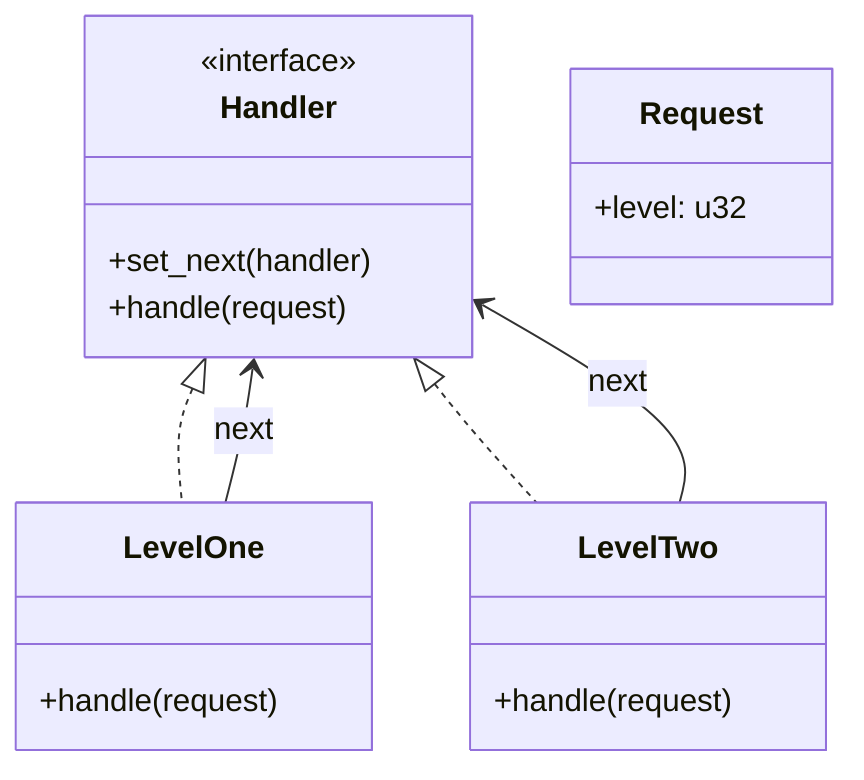
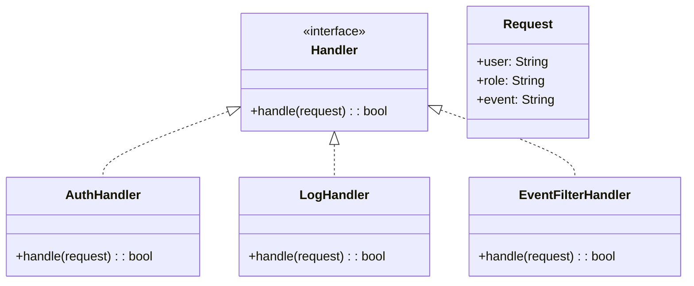
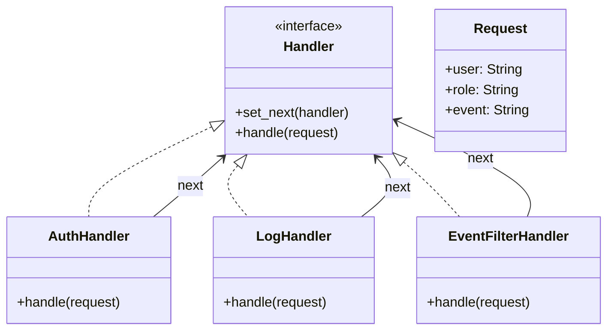

# Chain Of Responsibility

##  책임 연쇄 패턴이란?
- 요청을 처리할 수 있는 여러 객체(Handler)를 체인으로 연결
- 각 객체는 요청을 처리하거나 다음 객체로 넘김
- 결합도를 낮추고, 유연한 처리 흐름을 제공

## 🦀 Rust 기반 예제
Rust에서는 상속이 없기 때문에 트레이트와 구조체 조합으로 패턴을 구현합니다.

### 🔹 구조
- Handler: 처리 인터페이스 (트레이트)
- ConcreteHandler: 실제 처리자
- Request: 요청 객체
- main(): 체인 구성 및 실행
### 🧩 코드 예시
```rust
struct Request {
    level: u32,
}

trait Handler {
    fn set_next(&mut self, next: Box<dyn Handler>);
    fn handle(&self, req: &Request);
}

struct LevelOne {
    next: Option<Box<dyn Handler>>,
}

impl LevelOne {
    fn new() -> Self {
        LevelOne { next: None }
    }
}

impl Handler for LevelOne {
    fn set_next(&mut self, next: Box<dyn Handler>) {
        self.next = Some(next);
    }

    fn handle(&self, req: &Request) {
        if req.level <= 1 {
            println!("LevelOne 처리: level {}", req.level);
        } else if let Some(ref next) = self.next {
            next.handle(req);
        } else {
            println!("처리할 수 없음: level {}", req.level);
        }
    }
}

struct LevelTwo {
    next: Option<Box<dyn Handler>>,
}

impl LevelTwo {
    fn new() -> Self {
        LevelTwo { next: None }
    }
}

impl Handler for LevelTwo {
    fn set_next(&mut self, next: Box<dyn Handler>) {
        self.next = Some(next);
    }

    fn handle(&self, req: &Request) {
        if req.level <= 2 {
            println!("LevelTwo 처리: level {}", req.level);
        } else if let Some(ref next) = self.next {
            next.handle(req);
        } else {
            println!("처리할 수 없음: level {}", req.level);
        }
    }
}

fn main() {
    let mut h1 = LevelOne::new();
    let mut h2 = LevelTwo::new();

    h1.set_next(Box::new(h2));

    let req = Request { level: 2 };
    h1.handle(&req);
}
```

### 🔍 코드 원문
```rust
else if let Some(ref next) = self.next {
    next.handle(req);
}
```

### 🧠 설명
- self.next는 Option<Box<dyn Handler>> 타입이야. 즉, 다음 핸들러가 있을 수도 있고 없을 수도 있음.
- if let Some(ref next) = self.next는 self.next가 Some(...)일 때만 next를 꺼내서 사용할 수 있게 해주는 패턴 매칭 문법.
- ref next는 Box<dyn Handler>에 대한 불변 참조를 가져오는 거야. 그래서 next.handle(req)를 호출 할 수 있음.

### ✅ 왜 이렇게 써야 해?
Rust는 Option 타입을 직접 꺼내려면 match나 if let을 써야 함.
이렇게 하면 None일 경우 안전하게 무시하고, Some일 경우만 handle()을 호출.
즉, 이 코드는:
"다음 핸들러가 있다면, 그 핸들러에게 요청을 넘겨줘."
라는 의미.

#### 🔧 더 직관적인 버전으로 바꾸면?
if let Some(next) = &self.next {
    next.handle(req);
}
이렇게 써도 똑같이 동작해. ref 대신 &를 써서 참조를 가져오는 방식을 선호.

#### 🧪 예시 흐름
- AuthHandler가 요청을 받음
- 인증 성공 → self.next가 Some(LogHandler)
- LogHandler.handle(req) 호출됨
- 로그 처리 후 → self.next가 Some(EventFilterHandler)
- 이벤트 필터링 처리됨
이렇게 체인을 따라 요청이 흘러감.


## 🧭 Mermaid 클래스 다이어그램



## 🌐 다른 언어 예제들
### 🟦 Java
```java
class Request {
    int level;
    Request(int level) { this.level = level; }
}

abstract class Handler {
    protected Handler next;
    public void setNext(Handler next) { this.next = next; }
    public abstract void handle(Request req);
}

class LevelOne extends Handler {
    public void handle(Request req) {
        if (req.level <= 1)
            System.out.println("LevelOne 처리");
        else if (next != null)
            next.handle(req);
    }
}

public class Main {
    public static void main(String[] args) {
        Handler h1 = new LevelOne();
        Handler h2 = new LevelOne(); // 예시용으로 두 번 사용
        h1.setNext(h2);
        h1.handle(new Request(2));
    }
}
```


### 🐍 Python
```python
class Request:
    def __init__(self, level):
        self.level = level

class Handler:
    def __init__(self):
        self.next = None

    def set_next(self, handler):
        self.next = handler

    def handle(self, req):
        raise NotImplementedError

class LevelOne(Handler):
    def handle(self, req):
        if req.level <= 1:
            print("LevelOne 처리")
        elif self.next:
            self.next.handle(req)

if __name__ == "__main__":
    h1 = LevelOne()
    h2 = LevelOne()
    h1.set_next(h2)
    h1.handle(Request(2))
```


### 🧊 C++
```cpp
#include <iostream>

class Request {
public:
    int level;
    Request(int l) : level(l) {}
};

class Handler {
protected:
    Handler* next;
public:
    Handler() : next(nullptr) {}
    void setNext(Handler* h) { next = h; }
    virtual void handle(Request* req) = 0;
};

class LevelOne : public Handler {
public:
    void handle(Request* req) override {
        if (req->level <= 1)
            std::cout << "LevelOne 처리\n";
        else if (next)
            next->handle(req);
    }
};

int main() {
    LevelOne h1, h2;
    h1.setNext(&h2);
    Request req(2);
    h1.handle(&req);
}
```


### 🟪 C#
```csharp
using System;

class Request {
    public int Level { get; }
    public Request(int level) => Level = level;
}

abstract class Handler {
    protected Handler next;
    public void SetNext(Handler h) => next = h;
    public abstract void Handle(Request req);
}

class LevelOne : Handler {
    public override void Handle(Request req) {
        if (req.Level <= 1)
            Console.WriteLine("LevelOne 처리");
        else if (next != null)
            next.Handle(req);
    }
}

class Program {
    static void Main() {
        var h1 = new LevelOne();
        var h2 = new LevelOne();
        h1.SetNext(h2);
        h1.Handle(new Request(2));
    }
}
```


## ✅ 요약 비교
| 언어   | 구현 방식                  | 체인 연결 방식     | 특징                         |
|--------|----------------------------|--------------------|------------------------------|
| Rust   | 트레이트 + Box             | `set_next()`       | 안전한 소유권 관리           |
| Java   | 추상 클래스 상속           | `setNext()`        | 명확한 구조, 다형성 활용     |
| Python | 클래스 + 동적 바인딩       | `set_next()`       | 유연한 구조, 간결한 문법     |
| C++    | 추상 클래스 + 포인터       | `setNext()`        | 수동 메모리 관리 필요        |
| C#     | 추상 클래스 + 속성         | `SetNext()`        | 이벤트 기반 확장 가능        |


책임 연쇄 패턴은 조건 분기 로직을 객체로 분리해서 처리 흐름을 유연하게 함.
Build 패턴처럼 단계별로 처리되지만, 각 단계가 동적으로 결정되고, 처리 책임을 넘길 수 있다는 점에서 더 강력.


---

## 🦀 Rust 코드 예제 (Vec 기반 처리)
```rust
struct Request {
    user: String,
    role: String,
    event: String,
}

trait Handler {
    fn handle(&self, req: &Request) -> bool;
}

struct AuthHandler;

impl Handler for AuthHandler {
    fn handle(&self, req: &Request) -> bool {
        if req.role == "admin" {
            println!("✅ 인증 성공: {}", req.user);
            true
        } else {
            println!("❌ 인증 실패: {}", req.user);
            false
        }
    }
}

struct LogHandler;

impl Handler for LogHandler {
    fn handle(&self, req: &Request) -> bool {
        println!("📝 로그 기록: 사용자={}, 이벤트={}", req.user, req.event);
        true
    }
}

struct EventFilterHandler;

impl Handler for EventFilterHandler {
    fn handle(&self, req: &Request) -> bool {
        if req.event == "click" {
            println!("⚡ 이벤트 처리: {}", req.event);
            true
        } else {
            println!("🚫 이벤트 무시: {}", req.event);
            false
        }
    }
}

fn main() {
    let handlers: Vec<Box<dyn Handler>> = vec![
        Box::new(AuthHandler),
        Box::new(LogHandler),
        Box::new(EventFilterHandler),
    ];

    let req = Request {
        user: "JungHwan".to_string(),
        role: "admin".to_string(),
        event: "click".to_string(),
    };

    for handler in &handlers {
        let proceed = handler.handle(&req);
        if !proceed {
            println!("⛔ 체인 중단됨");
            break;
        }
    }
}
```


##  🔍 핵심 변경점
| 기존 방식         | Vec 기반 방식               |
|------------------|-----------------------------|
| `set_next()`      | `Vec<Box<dyn Handler>>`로 핸들러 리스트 구성 |
| `next.handle(req)`| `for` 루프로 순차 처리      |
| `None`            | `handle()`의 반환값으로 처리 여부 결정 |


## 🧭 Mermaid 클래스 다이어그램



## ✅ 요약
| 처리 단계            | 역할 설명                         |
|----------------------|-----------------------------------|
| `AuthHandler`         | 사용자 인증 (admin 여부 확인)     |
| `LogHandler`          | 요청 정보 로깅                    |
| `EventFilterHandler`  | 이벤트 타입 필터링 및 처리        |
| `Vec<Box<dyn Handler>>` | 핸들러들을 순차적으로 실행       |


---


## 실전 예제

**책임 연쇄 패턴 (Chain of Responsibility)**을 Rust에서 실제 시나리오에 적용.

## 주제는 다음 세 가지:
- ✅ 인증 처리 (Authentication)
- 📝 로깅 (Logging)
- ⚡ 이벤트 필터링 (Event Filtering)
각 처리 단계는 Handler 체인으로 연결되고, 요청(Request)을 받아서 처리하거나 다음 단계로 넘깁니다.

## 🧱 구조 개요
- Request: 사용자 요청 정보 (예: 사용자 이름, 권한, 이벤트 타입 등)
- Handler: 처리 트레이트
- AuthHandler: 인증 처리
- LogHandler: 로깅 처리
- EventFilterHandler: 이벤트 필터링
- main(): 체인 구성 및 실행

## 🦀 Rust 코드 예제
```rust
struct Request {
    user: String,
    role: String,
    event: String,
}

trait Handler {
    fn set_next(&mut self, next: Box<dyn Handler>);
    fn handle(&self, req: &Request);
}

struct AuthHandler {
    next: Option<Box<dyn Handler>>,
}

impl AuthHandler {
    fn new() -> Self {
        AuthHandler { next: None }
    }
}

impl Handler for AuthHandler {
    fn set_next(&mut self, next: Box<dyn Handler>) {
        self.next = Some(next);
    }

    fn handle(&self, req: &Request) {
        if req.role == "admin" {
            println!("✅ 인증 성공: {}", req.user);
            if let Some(ref next) = self.next {
                next.handle(req);
            }
        } else {
            println!("❌ 인증 실패: {}", req.user);
        }
    }
}

struct LogHandler {
    next: Option<Box<dyn Handler>>,
}

impl LogHandler {
    fn new() -> Self {
        LogHandler { next: None }
    }
}

impl Handler for LogHandler {
    fn set_next(&mut self, next: Box<dyn Handler>) {
        self.next = Some(next);
    }

    fn handle(&self, req: &Request) {
        println!("📝 로그 기록: 사용자={}, 이벤트={}", req.user, req.event);
        if let Some(ref next) = self.next {
            next.handle(req);
        }
    }
}

struct EventFilterHandler {
    next: Option<Box<dyn Handler>>,
}

impl EventFilterHandler {
    fn new() -> Self {
        EventFilterHandler { next: None }
    }
}

impl Handler for EventFilterHandler {
    fn set_next(&mut self, next: Box<dyn Handler>) {
        self.next = Some(next);
    }

    fn handle(&self, req: &Request) {
        if req.event == "click" {
            println!("⚡ 이벤트 처리: {}", req.event);
        } else {
            println!("🚫 이벤트 무시: {}", req.event);
        }

        if let Some(ref next) = self.next {
            next.handle(req);
        }
    }
}

fn main() {
    let mut auth = AuthHandler::new();
    let mut logger = LogHandler::new();
    let mut filter = EventFilterHandler::new();

    // 체인 연결: Auth → Logger → Filter
    auth.set_next(Box::new(logger));
    logger.set_next(Box::new(filter));

    let req = Request {
        user: "JungHwan".to_string(),
        role: "admin".to_string(),
        event: "click".to_string(),
    };

    auth.handle(&req);
}
```


## 🧭 Mermaid 클래스 다이어그램



## ✅ 요약
| 처리 단계            | 역할 설명                         |
|----------------------|-----------------------------------|
| `AuthHandler`         | 사용자 인증 (예: admin 여부 확인) |
| `LogHandler`          | 요청 정보 로깅                    |
| `EventFilterHandler`  | 이벤트 타입 필터링 및 처리        |


