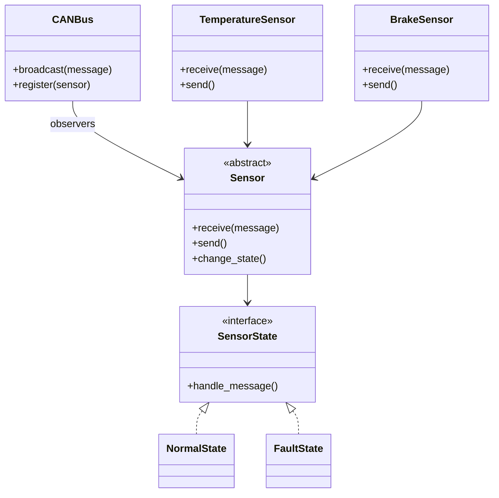
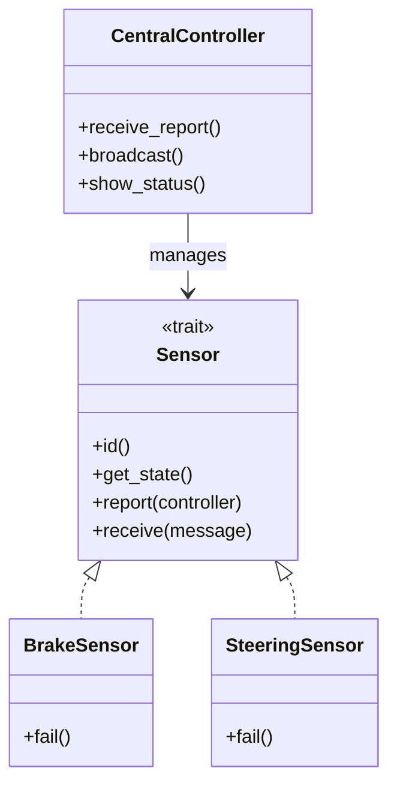
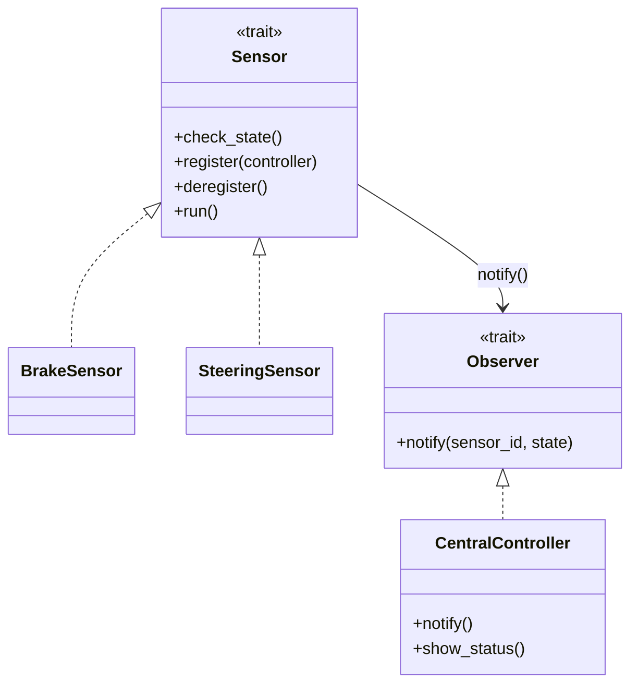

# CAN Sample

## 🎯 적합한 디자인 패턴
| 디자인 패턴             | 적용 이유 및 역할 설명                                               |
|------------------------|---------------------------------------------------------------------|
| Observer               | 센서들이 중앙 메시지를 수신하고, 상태 변화에 따라 반응함 (구독자 모델)     |
| Mediator               | 센서 간 직접 연결 없이 중앙 통제 장치(CAN 버스)가 메시지를 중재함         |
| State                  | 센서가 고장 상태로 전환되면 동작 방식이 바뀜 (예: 송신 차단, 무시 등)     |
| Strategy               | 센서마다 고장 대응 방식이 다를 경우, 전략을 바꿔서 행동을 결정함           |
| Chain of Responsibility| 메시지를 순차적으로 전달하며, 각 센서가 조건에 따라 처리하거나 무시함     |
| Command                | 센서가 수행할 동작을 캡슐화하여 중앙에서 명령을 발행하고 실행함           |


## 🧠 구조적으로 보면
- 센서들은 Observer: 브로드캐스트 메시지를 수신하고, 자신의 상태에 따라 반응
- CAN 버스는 Mediator: 센서 간 직접 연결 없이 메시지를 중재
- 센서의 고장 상태는 State: 고장나면 송신 차단, 수신 무시 등 상태 기반 동작
- 센서의 반응 방식은 Strategy: 예를 들어, 온도 센서는 경고만, 브레이크 센서는 즉시 작동 중지

## 🧩 Mermaid 다이어그램 예시



## ✅ Rust 스타일로 구성하면
- Sensor trait: receive(), send(), change_state()
- CANBus: 센서들을 등록하고 broadcast()
- SensorState: Normal, Fault 상태로 나눠서 동작 제어
- 각 센서는 Box<dyn Sensor>로 관리하며, 상태에 따라 동작 변경

## 🦀 Rust 코드 예제
```rust
use std::collections::HashMap;

// 센서 상태
#[derive(Debug, Clone, PartialEq)]
enum SensorState {
    Normal,
    Faulty,
}

// 센서 trait
trait Sensor {
    fn id(&self) -> String;
    fn get_state(&self) -> SensorState;
    fn report(&self, controller: &mut CentralController);
    fn receive(&mut self, message: &str);
}

// 브레이크 센서
struct BrakeSensor {
    state: SensorState,
}

impl BrakeSensor {
    fn new() -> Self {
        Self {
            state: SensorState::Normal,
        }
    }

    fn fail(&mut self) {
        self.state = SensorState::Faulty;
    }
}

impl Sensor for BrakeSensor {
    fn id(&self) -> String {
        "BrakeSensor".to_string()
    }

    fn get_state(&self) -> SensorState {
        self.state.clone()
    }

    fn report(&self, controller: &mut CentralController) {
        controller.receive_report(self.id(), self.get_state());
    }

    fn receive(&mut self, message: &str) {
        if self.state == SensorState::Faulty {
            println!("{}: Faulty. Ignoring message.", self.id());
        } else {
            println!("{} received: {}", self.id(), message);
        }
    }
}

// 조향 축 센서
struct SteeringSensor {
    state: SensorState,
}

impl SteeringSensor {
    fn new() -> Self {
        Self {
            state: SensorState::Normal,
        }
    }

    fn fail(&mut self) {
        self.state = SensorState::Faulty;
    }
}

impl Sensor for SteeringSensor {
    fn id(&self) -> String {
        "SteeringSensor".to_string()
    }

    fn get_state(&self) -> SensorState {
        self.state.clone()
    }

    fn report(&self, controller: &mut CentralController) {
        controller.receive_report(self.id(), self.get_state());
    }

    fn receive(&mut self, message: &str) {
        if self.state == SensorState::Faulty {
            println!("{}: Faulty. Ignoring message.", self.id());
        } else {
            println!("{} received: {}", self.id(), message);
        }
    }
}

// 중앙 통제 장치
struct CentralController {
    sensor_states: HashMap<String, SensorState>,
    user_info: String,
}

impl CentralController {
    fn new(user_info: &str) -> Self {
        Self {
            sensor_states: HashMap::new(),
            user_info: user_info.to_string(),
        }
    }

    fn receive_report(&mut self, sensor_id: String, state: SensorState) {
        println!("Controller received report from {}: {:?}", sensor_id, state);
        self.sensor_states.insert(sensor_id, state);
    }

    fn broadcast(&self, message: &str, sensors: &mut Vec<Box<dyn Sensor>>) {
        println!("Controller broadcasting: {}", message);
        for sensor in sensors.iter_mut() {
            sensor.receive(message);
        }
    }

    fn show_status(&self) {
        println!("--- Sensor Status ---");
        for (id, state) in &self.sensor_states {
            println!("{}: {:?}", id, state);
        }
    }
}

// 메인 시뮬레이션
fn main() {
    let mut controller = CentralController::new("User: JungHwan");

    let mut brake = Box::new(BrakeSensor::new());
    let mut steering = Box::new(SteeringSensor::new());

    let mut sensors: Vec<Box<dyn Sensor>> = vec![brake, steering];

    // 초기 상태 보고
    for sensor in sensors.iter() {
        sensor.report(&mut controller);
    }

    controller.broadcast("System Check", &mut sensors);

    // 브레이크 센서 고장
    sensors[0].as_mut().receive("Brake failure detected");
    sensors[0].as_mut().report(&mut controller);
    sensors[0].as_mut().receive("Emergency Stop");

    // 조향 센서 정상 동작
    sensors[1].as_mut().receive("Steering calibration");

    controller.show_status();
}
```


## ✅ 주요 동작 흐름
| 구성 요소           | 주요 동작 설명                                      |
|--------------------|-----------------------------------------------------|
| `Sensor`           | 공통 인터페이스: `report()`로 상태 보고, `receive()`로 메시지 수신 |
| `BrakeSensor`      | 고장 시 메시지 무시, 상태 보고 수행                  |
| `SteeringSensor`   | 정상 상태에서 메시지 수신 및 반응                    |
| `CentralController`| 센서 상태 수집, 사용자 정보 보유, 메시지 브로드캐스트 |
| `main()`           | 센서 초기화, 상태 보고, 고장 시뮬레이션, 전체 흐름 실행 |


🧩 Mermaid 클래스 다이어그램



---


## 🦀 Rust 스타일 구조 (RTOS 시뮬레이션 기반)
Rust에서는 RTOS를 직접 쓰기보다는 async 기반으로 시뮬레이션할 수 있어요:
```rust
use std::collections::HashMap;

trait Observer {
    fn notify(&self, sensor_id: &str, state: SensorState);
}

#[derive(Debug, Clone, PartialEq)]
enum SensorState {
    Normal,
    Faulty,
}

trait Sensor {
    fn id(&self) -> String;
    fn check_state(&self) -> SensorState;
    fn register(&mut self, controller: Box<dyn Observer>);
    fn deregister(&mut self);
    fn run(&mut self); // RTOS 태스크처럼 주기적 실행
}

struct CentralController {
    sensor_states: HashMap<String, SensorState>,
}

impl CentralController {
    fn new() -> Self {
        Self {
            sensor_states: HashMap::new(),
        }
    }

    fn show_status(&self) {
        println!("--- Sensor Status ---");
        for (id, state) in &self.sensor_states {
            println!("{}: {:?}", id, state);
        }
    }
}

impl Observer for CentralController {
    fn notify(&self, sensor_id: &str, state: SensorState) {
        println!("Controller received: {} is {:?}", sensor_id, state);
        // 실시간 처리 로직 삽입 가능
    }
}
```

실제 RTOS에서는 Sensor::run()이 각 태스크로 분리되고,
notify()는 메시지 큐 또는 이벤트 플래그로 구현됩니다.


## 🧩 Mermaid 구조도



## 💡 RTOS에서의 확장 포인트
- SensorManager 태스크: 센서 등록/제거 관리
- FaultHandler: 고장 감지 시 자동 대응 (예: fail-safe 모드 진입)
- TelemetryLogger: 상태 변화 로그 기록 및 외부 전송
- Priority Scheduler: 센서별 우선순위 기반 스케줄링
---
