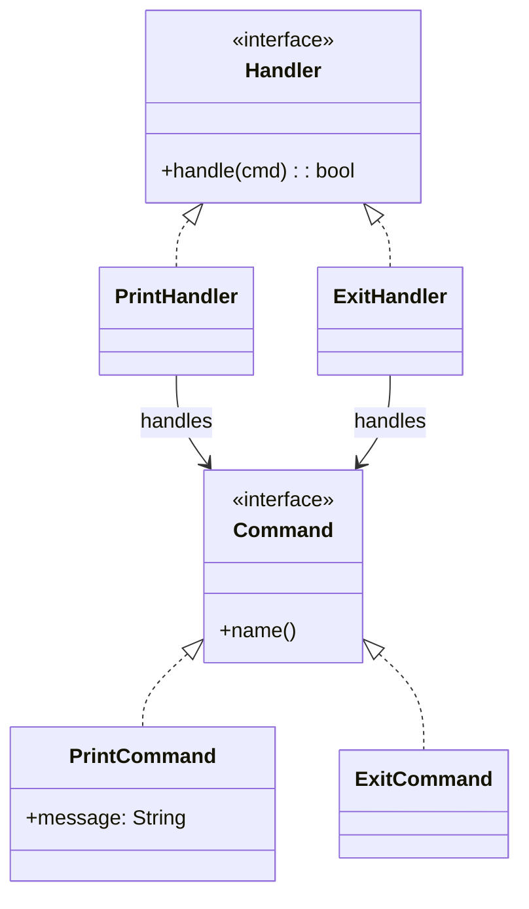
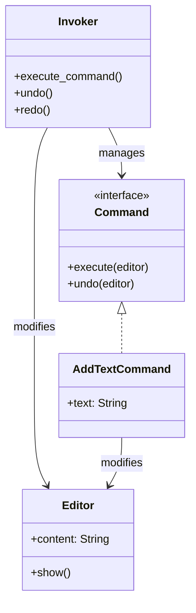

# Command Pattern

## 🧠 커맨드 + 책임 연쇄 패턴이란?
- Command Pattern: 요청을 객체로 캡슐화하여 실행자와 요청자를 분리
- Chain of Responsibility: 여러 핸들러 중 하나가 요청을 처리하거나 다음으로 넘김
- 결합: 커맨드 객체를 핸들러 체인에 전달하여 처리

## 🦀 Rust 예제: Command + Chain of Responsibility
### 🔹 구조
- Command: 명령 트레이트
- PrintCommand, ExitCommand: 명령 구현체
- Handler: 명령 처리 트레이트
- PrintHandler, ExitHandler: 핸들러 구현체
- main(): 명령 실행 흐름
### 🧩 Rust 코드
```rust
trait Command {
    fn name(&self) -> &str;
}

struct PrintCommand {
    message: String,
}

impl Command for PrintCommand {
    fn name(&self) -> &str {
        "print"
    }
}

struct ExitCommand;

impl Command for ExitCommand {
    fn name(&self) -> &str {
        "exit"
    }
}

trait Handler {
    fn handle(&self, cmd: &dyn Command) -> bool;
}

struct PrintHandler;

impl Handler for PrintHandler {
    fn handle(&self, cmd: &dyn Command) -> bool {
        if cmd.name() == "print" {
            let print_cmd = cmd.downcast_ref::<PrintCommand>().unwrap();
            println!("🖨️ 출력: {}", print_cmd.message);
            true
        } else {
            false
        }
    }
}

struct ExitHandler;

impl Handler for ExitHandler {
    fn handle(&self, cmd: &dyn Command) -> bool {
        if cmd.name() == "exit" {
            println!("🚪 종료 명령 처리됨");
            true
        } else {
            false
        }
    }
}

fn main() {
    let handlers: Vec<Box<dyn Handler>> = vec![
        Box::new(PrintHandler),
        Box::new(ExitHandler),
    ];

    let commands: Vec<Box<dyn Command>> = vec![
        Box::new(PrintCommand { message: "Hello, JungHwan!".to_string() }),
        Box::new(ExitCommand),
    ];

    for cmd in commands {
        let mut handled = false;
        for handler in &handlers {
            if handler.handle(cmd.as_ref()) {
                handled = true;
                break;
            }
        }
        if !handled {
            println!("⚠️ 처리되지 않은 명령: {}", cmd.name());
        }
    }
}
```

### 🔧 downcast_ref는 Rust에서 안전하게 타입 캐스팅하려면 Any 트레이트를 써야 함.  
여기선 간단화를 위해 생략했지만, 실제 구현에선 dyn Any + downcast_ref::<T>()를 써야 함.


### 🔧 any 어떻게 쓰는가?
- 트레이트에 as_any() 메서드를 추가해야 해요:
```rust
use std::any::Any;

trait Command {
    fn name(&self) -> &str;
    fn as_any(&self) -> &dyn Any;
}


- 각 구현체에서 as_any()를 구현:
impl Command for PrintCommand {
    fn name(&self) -> &str { "print" }
    fn as_any(&self) -> &dyn Any { self }
}
```

- 핸들러에서 다운캐스트:
```rust
if cmd.name() == "print" {
    if let Some(print_cmd) = cmd.as_any().downcast_ref::<PrintCommand>() {
        println!("🖨️ 출력: {}", print_cmd.message);
    }
}
```


### ⚠️ 왜 이렇게 복잡할까?
Rust는 정적 타입 언어라서, 런타임 타입 정보가 기본적으로 없어요.
그래서 Any 트레이트를 통해 런타임 타입 식별을 가능하게 하고, downcast_ref로 안전하게 변환하는 거예요.

### ✅ 요약
| 개념           | 설명                         |
|----------------|------------------------------|
| `as_any()`     | `dyn Any`로 변환해 다운캐스트 가능하게 함 |
| `downcast_ref` | `Option<&T>` 반환, 런타임 타입 확인 후 참조 획득 |


## 🧭 Mermaid 클래스 다이어그램



## 🌐 다른 언어 예제들
### 🟦 Java
```java
interface Command {
    String name();
}

class PrintCommand implements Command {
    String message;
    PrintCommand(String msg) { message = msg; }
    public String name() { return "print"; }
}

interface Handler {
    boolean handle(Command cmd);
}

class PrintHandler implements Handler {
    public boolean handle(Command cmd) {
        if (cmd.name().equals("print")) {
            System.out.println("Print: " + ((PrintCommand)cmd).message);
            return true;
        }
        return false;
    }
}

public class Main {
    public static void main(String[] args) {
        Command cmd = new PrintCommand("Hello");
        Handler handler = new PrintHandler();
        handler.handle(cmd);
    }
}
```


### 🐍 Python
```python
class Command:
    def name(self): pass

class PrintCommand(Command):
    def __init__(self, msg): self.message = msg
    def name(self): return "print"

class Handler:
    def handle(self, cmd): pass

class PrintHandler(Handler):
    def handle(self, cmd):
        if cmd.name() == "print":
            print("Print:", cmd.message)
            return True
        return False

if __name__ == "__main__":
    cmd = PrintCommand("Hello")
    handler = PrintHandler()
    handler.handle(cmd)
```


### 🧊 C++
```cpp
#include <iostream>
#include <string>

class Command {
public:
    virtual std::string name() const = 0;
};

class PrintCommand : public Command {
public:
    std::string message;
    PrintCommand(std::string msg) : message(msg) {}
    std::string name() const override { return "print"; }
};

class Handler {
public:
    virtual bool handle(Command* cmd) = 0;
};

class PrintHandler : public Handler {
public:
    bool handle(Command* cmd) override {
        if (cmd->name() == "print") {
            PrintCommand* pc = dynamic_cast<PrintCommand*>(cmd);
            std::cout << "Print: " << pc->message << "\n";
            return true;
        }
        return false;
    }
};

int main() {
    PrintCommand cmd("Hello");
    PrintHandler handler;
    handler.handle(&cmd);
}
```


### 🟪 C#
```csharp
using System;

interface ICommand {
    string Name { get; }
}

class PrintCommand : ICommand {
    public string Message { get; }
    public PrintCommand(string msg) => Message = msg;
    public string Name => "print";
}

interface IHandler {
    bool Handle(ICommand cmd);
}

class PrintHandler : IHandler {
    public bool Handle(ICommand cmd) {
        if (cmd.Name == "print") {
            var pc = cmd as PrintCommand;
            Console.WriteLine("Print: " + pc.Message);
            return true;
        }
        return false;
    }
}

class Program {
    static void Main() {
        var cmd = new PrintCommand("Hello");
        var handler = new PrintHandler();
        handler.Handle(cmd);
    }
}
```


## ✅ 요약 비교
| 언어   | Command 구현 방식       | Handler 처리 방식        | 특징                         |
|--------|--------------------------|---------------------------|------------------------------|
| Rust   | 트레이트 + Box           | `Vec<Box<dyn Handler>>` 순회 | 안전한 타입 처리 필요         |
| Java   | 인터페이스 + 캐스팅      | `handle()`에서 타입 체크   | 명확한 구조, 다형성 활용      |
| Python | 클래스 + 동적 바인딩     | `handle()`에서 이름 비교   | 간결하고 유연한 문법          |
| C++    | 추상 클래스 + RTTI       | `dynamic_cast`로 타입 확인 | 수동 메모리 관리 필요         |
| C#     | 인터페이스 + as 캐스팅   | `Handle()`에서 타입 분기   | 이벤트 기반 확장 가능         |

---

# Undo/Redo 시스템

이번엔 커맨드 패턴 + 책임 연쇄 패턴을 확장해서 Undo/Redo 시스템을 Rust로 구현.
이 구조는 특히 텍스트 편집기, 그래픽 툴, 게임 상태 관리 등에서 자주 쓰임.

## 🧠 Undo/Redo 시스템 핵심 개념
- Command 객체는 execute()와 undo() 메서드를 가짐
- 실행된 명령은 스택에 저장됨
- Undo 시에는 최근 명령을 되돌림
- Redo 시에는 되돌린 명령을 다시 실행

## 🦀 Rust 예제: Undo/Redo 시스템
### 🔹 구조
- Command: 트레이트 (execute, undo)
- AddTextCommand: 텍스트 추가 명령
- Editor: 상태를 갖는 대상
- Invoker: 명령 실행 + Undo/Redo 관리
### 🧩 코드 예시
```rust
trait Command {
    fn execute(&mut self, editor: &mut Editor);
    fn undo(&mut self, editor: &mut Editor);
}

struct AddTextCommand {
    text: String,
}

impl AddTextCommand {
    fn new(text: &str) -> Self {
        AddTextCommand { text: text.to_string() }
    }
}

impl Command for AddTextCommand {
    fn execute(&mut self, editor: &mut Editor) {
        editor.content.push_str(&self.text);
        println!("✏️ 실행: 추가된 텍스트 '{}'", self.text);
    }

    fn undo(&mut self, editor: &mut Editor) {
        let len = self.text.len();
        editor.content.truncate(editor.content.len().saturating_sub(len));
        println!("↩️ 실행 취소: '{}' 제거됨", self.text);
    }
}

struct Editor {
    content: String,
}

impl Editor {
    fn new() -> Self {
        Editor { content: String::new() }
    }

    fn show(&self) {
        println!("📄 현재 내용: '{}'", self.content);
    }
}

struct Invoker {
    undo_stack: Vec<Box<dyn Command>>,
    redo_stack: Vec<Box<dyn Command>>,
}

impl Invoker {
    fn new() -> Self {
        Invoker {
            undo_stack: Vec::new(),
            redo_stack: Vec::new(),
        }
    }

    fn execute_command(&mut self, mut cmd: Box<dyn Command>, editor: &mut Editor) {
        cmd.execute(editor);
        self.undo_stack.push(cmd);
        self.redo_stack.clear(); // 새 명령 실행 시 redo 초기화
    }

    fn undo(&mut self, editor: &mut Editor) {
        if let Some(mut cmd) = self.undo_stack.pop() {
            cmd.undo(editor);
            self.redo_stack.push(cmd);
        } else {
            println!("⚠️ 실행 취소할 명령 없음");
        }
    }

    fn redo(&mut self, editor: &mut Editor) {
        if let Some(mut cmd) = self.redo_stack.pop() {
            cmd.execute(editor);
            self.undo_stack.push(cmd);
        } else {
            println!("⚠️ 다시 실행할 명령 없음");
        }
    }
}

fn main() {
    let mut editor = Editor::new();
    let mut invoker = Invoker::new();

    invoker.execute_command(Box::new(AddTextCommand::new("Hello ")), &mut editor);
    invoker.execute_command(Box::new(AddTextCommand::new("JungHwan!")), &mut editor);
    editor.show();

    invoker.undo(&mut editor);
    editor.show();

    invoker.redo(&mut editor);
    editor.show();
}
```


🧭 Mermaid 클래스 다이어그램



## ✅ 요약
| 구성 요소       | 역할 설명                                   |
|----------------|----------------------------------------------|
| `Command`       | 명령 인터페이스 (`execute`, `undo`)         |
| `AddTextCommand`| 텍스트 추가 명령 구현체                     |
| `Editor`        | 상태를 갖는 대상 (문서, 텍스트 등)          |
| `Invoker`       | 명령 실행 및 Undo/Redo 스택 관리            |

---


