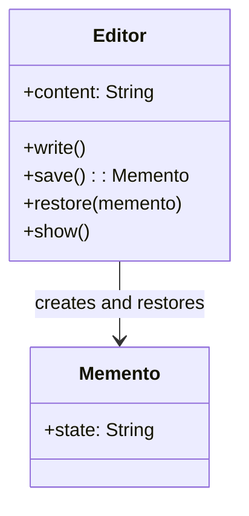

# Memento

## 🧠 메멘토 패턴이란?
- 객체의 캡슐화된 내부 상태를 외부에 노출하지 않고 저장
- 나중에 그 상태로 복원할 수 있게 함
- 구성 요소:
- Originator: 상태를 가진 객체
- Memento: 상태의 스냅샷
- Caretaker: 상태를 저장하고 복원 요청

## 🦀 Rust 예제: 메멘토 패턴
### 🔹 시나리오
텍스트 편집기에서 상태를 저장하고 복원하는 구조

### 🧩 코드 예시
```rust
#[derive(Clone)]
struct Memento {
    state: String,
}

struct Editor {
    content: String,
}

impl Editor {
    fn new() -> Self {
        Editor {
            content: String::new(),
        }
    }

    fn write(&mut self, text: &str) {
        self.content.push_str(text);
        println!("✏️ 작성됨: '{}'", text);
    }

    fn save(&self) -> Memento {
        println!("💾 상태 저장됨");
        Memento {
            state: self.content.clone(),
        }
    }

    fn restore(&mut self, memento: &Memento) {
        self.content = memento.state.clone();
        println!("↩️ 상태 복원됨");
    }

    fn show(&self) {
        println!("📄 현재 내용: '{}'", self.content);
    }
}

fn main() {
    let mut editor = Editor::new();
    let mut history: Vec<Memento> = Vec::new();

    editor.write("Hello ");
    history.push(editor.save());

    editor.write("JungHwan!");
    editor.show();

    editor.restore(&history[0]);
    editor.show();
}
```


### 🧭 Mermaid 클래스 다이어그램



## 🌐 다른 언어 예제들
### 🟦 Java
```java
class Memento {
    private final String state;
    public Memento(String state) { this.state = state; }
    public String getState() { return state; }
}

class Editor {
    private String content = "";

    public void write(String text) {
        content += text;
        System.out.println("✏️ 작성됨: " + text);
    }

    public Memento save() {
        System.out.println("💾 상태 저장됨");
        return new Memento(content);
    }

    public void restore(Memento m) {
        content = m.getState();
        System.out.println("↩️ 상태 복원됨");
    }

    public void show() {
        System.out.println("📄 현재 내용: " + content);
    }
}

public class Main {
    public static void main(String[] args) {
        Editor editor = new Editor();
        editor.write("Hello ");
        Memento snapshot = editor.save();

        editor.write("JungHwan!");
        editor.show();

        editor.restore(snapshot);
        editor.show();
    }
}
```

## 🐍 Python
```python
class Memento:
    def __init__(self, state):
        self.state = state

class Editor:
    def __init__(self):
        self.content = ""

    def write(self, text):
        self.content += text
        print(f"✏️ 작성됨: {text}")

    def save(self):
        print("💾 상태 저장됨")
        return Memento(self.content)

    def restore(self, memento):
        self.content = memento.state
        print("↩️ 상태 복원됨")

    def show(self):
        print(f"📄 현재 내용: {self.content}")

if __name__ == "__main__":
    editor = Editor()
    editor.write("Hello ")
    snapshot = editor.save()

    editor.write("JungHwan!")
    editor.show()

    editor.restore(snapshot)
    editor.show()
```


### 🧊 C++
```csharp
using System;

class Memento {
    public string State { get; }
    public Memento(string state) => State = state;
}

class Editor {
    private string content = "";

    public void Write(string text) {
        content += text;
        Console.WriteLine($"✏️ 작성됨: {text}");
    }

    public Memento Save() {
        Console.WriteLine("💾 상태 저장됨");
        return new Memento(content);
    }

    public void Restore(Memento m) {
        content = m.State;
        Console.WriteLine("↩️ 상태 복원됨");
    }

    public void Show() {
        Console.WriteLine($"📄 현재 내용: {content}");
    }
}

class Program {
    static void Main() {
        var editor = new Editor();
        editor.Write("Hello ");
        var snapshot = editor.Save();

        editor.Write("JungHwan!");
        editor.Show();

        editor.Restore(snapshot);
        editor.Show();
    }
}
```


### 🟪 C#
```csharp
using System;

class Memento {
    public string State { get; }
    public Memento(string state) => State = state;
}

class Editor {
    private string content = "";

    public void Write(string text) {
        content += text;
        Console.WriteLine($"✏️ 작성됨: {text}");
    }

    public Memento Save() {
        Console.WriteLine("💾 상태 저장됨");
        return new Memento(content);
    }

    public void Restore(Memento m) {
        content = m.State;
        Console.WriteLine("↩️ 상태 복원됨");
    }

    public void Show() {
        Console.WriteLine($"📄 현재 내용: {content}");
    }
}

class Program {
    static void Main() {
        var editor = new Editor();
        editor.Write("Hello ");
        var snapshot = editor.Save();

        editor.Write("JungHwan!");
        editor.Show();

        editor.Restore(snapshot);
        editor.Show();
    }
}
```


## ✅ 요약 비교
| 언어   | 상태 저장 방식         | 복원 방식             | 특징                         |
|--------|------------------------|------------------------|------------------------------|
| Rust   | `clone()`으로 복사     | `restore()`로 복원     | 안전한 소유권 관리           |
| Java   | `Memento` 객체로 저장 | `getState()`로 복원    | 캡슐화 유지                  |
| Python | 클래스 기반 저장       | 직접 필드 복원         | 간결하고 유연한 문법         |
| C++    | 복사 생성자 사용       | `getState()`로 복원    | 수동 메모리 관리 필요        |
| C#     | 속성 기반 저장         | `State`로 복원         | 이벤트 기반 확장 가능        |


---


